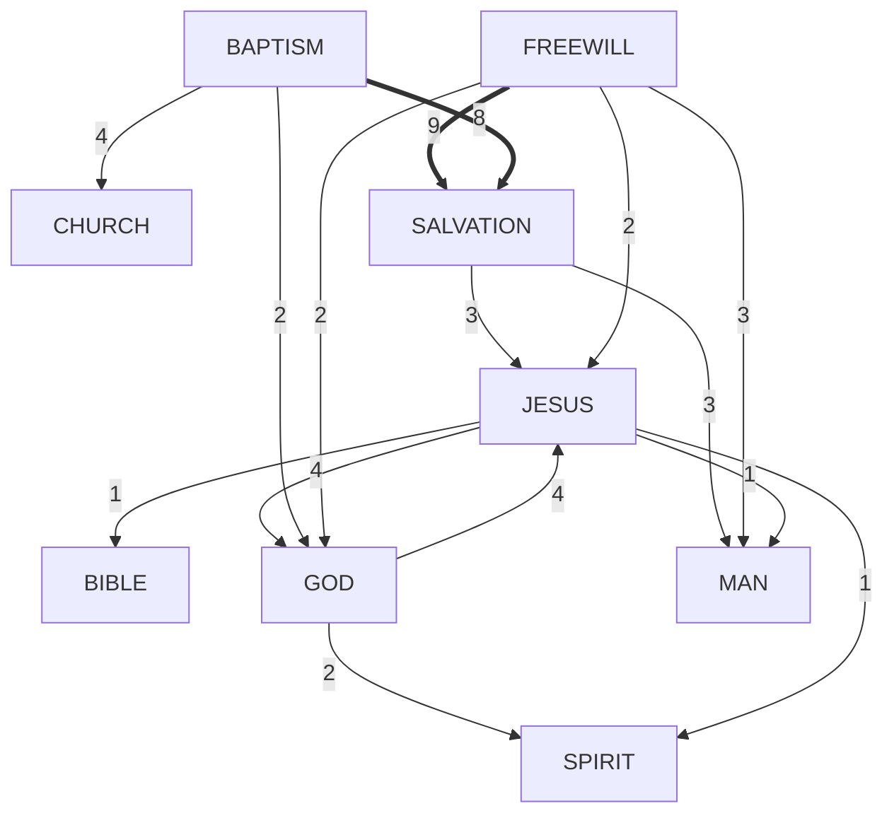
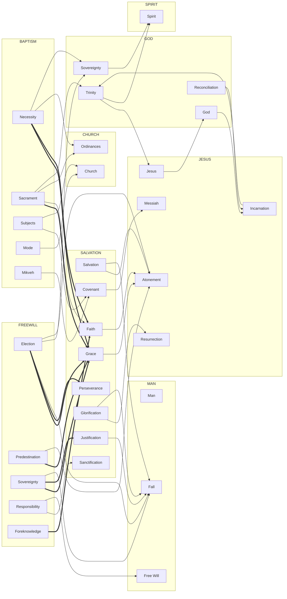

[About](#site/about 'Parent')
---
Visual representation of the theological lattice structure. These diagrams show how doctrines interconnect rather than standing in isolated hierarchies.

**Key insight:** 89.7% of links stay within categories (topic coherence), while 10.3% create cross-category connections (the lattice web).

---
# Cross-Category Summary

This high-level view shows how the major theological domains connect to each other.

## Analysis

**Total links:** 525
- **Within-category:** 471 (89.7%) - Maintaining topic coherence
- **Cross-category:** 54 (10.3%) - Creating the lattice web

**Top Cross-Category Connections:**

1. **freewill → salvation** (9 links) - Election/predestination theology is core to soteriology
2. **baptism → salvation** (8 links) - Baptismal theology directly impacts salvation doctrine
3. **god ↔ jesus** (4 each way) - Christology and theology proper are deeply intertwined
4. **baptism → church** (4 links) - Ecclesiology and sacramental theology connect
5. **salvation → jesus** (3 links) - Christology grounds soteriology
6. **salvation → man** (3 links) - Anthropology and soteriology intersect
7. **freewill → man** (3 links) - Human agency and anthropology

**Observations:**
- **bible** folder has ZERO outbound cross-category links (purely bibliology-focused)
- **church** folder has minimal cross-category links (only 2 total)
- **freewill** has the most cross-category connections (16 total)

# Detailed Connection Map

This detailed view shows specific cross-category file connections grouped by theological domain.

## Key Insights

### Centrality of Salvation
The **salvation** folder is the most connected hub, receiving links from:
- **freewill** (9) - How God saves (election, grace, perseverance)
- **baptism** (8) - The means of entering salvation
- Linking out to **jesus** (3) and **man** (3)

This reflects salvation as the central organizing doctrine that ties together:
- God's sovereignty (freewill debates)
- The means of grace (baptism, sacraments)
- Christ's work (atonement, resurrection)
- Human nature (fall, redemption)

### The God-Jesus Connection
The bidirectional connection between **god** and **jesus** folders (4 links each way) demonstrates the core Christological tension:
- Who is Jesus in relation to God? (Christology)
- How does the incarnation affect our understanding of God? (Theology proper)

This is the heart of Trinitarian theology - you cannot fully understand one without the other.

### Baptism as Theological Nexus
**Baptism** connects to multiple domains:
- **salvation** (8) - Is it necessary? Does it convey grace?
- **church** (4) - Who is baptized? What does baptism signify about the church?
- **god** (2) - Sacramental theology and divine sovereignty

This makes baptism one of the most divisive practices in Christianity - it touches ecclesiology, soteriology, sacramental theology, and covenant theology simultaneously.

### Freewill's Reach
**Freewill** has the broadest cross-category impact (16 total links):
- **salvation** (9) - Election, grace, perseverance
- **man** (3) - Human agency, the fall
- **god** (2) - Divine sovereignty
- **jesus** (2) - Atonement and predestination

The sovereignty-freedom tension affects nearly every theological domain.

### Bible's Isolation
**Bible** has ZERO outbound cross-category links. This is intentional - bibliology focuses on Scripture itself (inspiration, inerrancy, interpretation) without importing debates from other domains.

---
# See Also

**Site Navigation:**
- [About](#site/about 'Parent') - Project overview and design rationale
- [Table of Contents](#TOC 'Drill') - All major theological categories

**Explore the Lattice:**
- Start anywhere and follow the links - the structure emerges through exploration
- Notice how concepts appear in multiple contexts with different emphases
- The Hebrew-Greek tension is the lens, not the hierarchy
