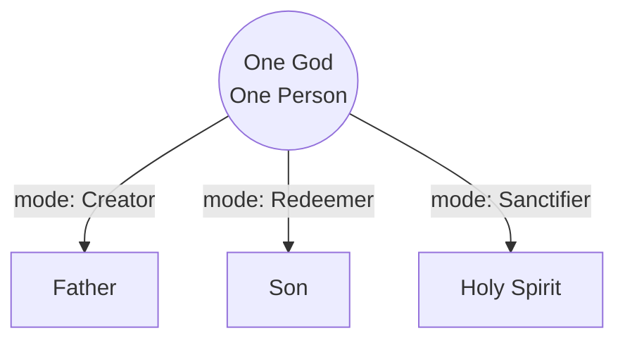
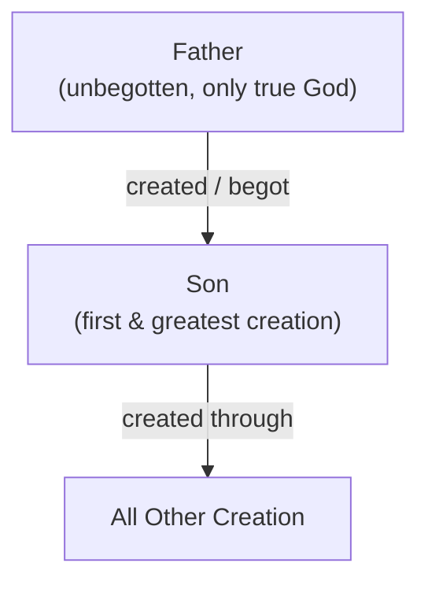
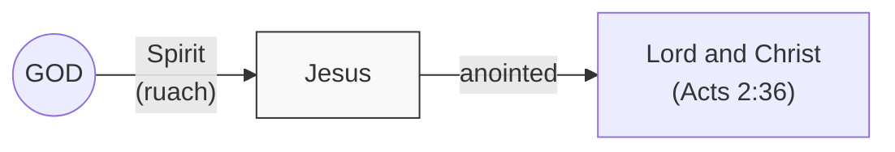
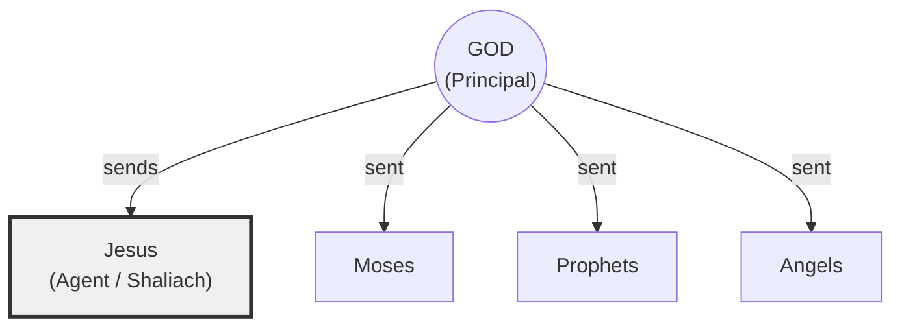

# Jesus: What Does It Mean to Be the Son of God?

A study of Jesus's identity, examining how different traditions understand what it means when Scripture calls Jesus "the Son of God" — and how that differs from all believers being called "sons of God."

---

## Guardrails: The Outer Limits of Christian Belief About Jesus

Before exploring the *internal* debates among Christians about Jesus's identity, it helps to mark the outer boundaries — positions that place a person *outside* Christian faith altogether. These are not lines drawn over minor disputes. The five voices contributing to this handout — a Trinitarian, a Jewish theologian, a Spirit Christologist, Arius, and Sabellius — disagree sharply on the inner questions. But they agree on these outer walls.

**1. Jesus was a real historical person — not a myth or legend.**
Jesus of Nazareth actually lived, was crucified under Pontius Pilate, and was buried. This is confirmed by Roman historians (Tacitus, *Annals* 15.44; Josephus, *Antiquities* 18.3) and is not seriously disputed in mainstream scholarship.

*Outside this line:* Mythicism — the fringe view that Jesus never existed. It requires wholesale rejection of both Christian and non-Christian ancient sources.

**2. Jesus was Jewish — and inseparable from the God of Israel.**
He was circumcised, Torah-observant, synagogue-attending, and rooted in the story of Abraham, Isaac, and Jacob. When asked for the greatest commandment, He quoted the Shema: "Hear, O Israel: The Lord our God, the Lord is one" (Mark 12:29). A Jesus divorced from Israel is a fiction.

*Outside this line:* Marcionism — the view that the God of the Old Testament is a different, inferior deity from the Father of Jesus. The church rejected this decisively: the Father of Jesus *is* the God of Abraham.

**3. Jesus bodily rose from the dead.**
The resurrection is not a metaphor for the disciples' renewed hope. The tomb was physically empty. Paul stakes everything on it: "If Christ has not been raised, your faith is futile" (1 Corinthians 15:17).

*Outside this line:* Any framework that reduces Easter to a spiritual symbol or a subjective experience. The body matters. The empty tomb matters.

**4. Jesus is Lord — and this title carries the weight of YHWH.**
To confess "Jesus is Lord" (*Kurios*) in the first-century Jewish world was an extraordinary claim. *Kurios* is the word the Greek Old Testament uses to translate YHWH. Whether Jesus *is* YHWH or carries YHWH's full authority is an internal debate. That He is Lord in some profound, YHWH-connected sense is not.

*Outside this line:* Reducing Jesus to a great moral teacher, a prophet, or an inspiring example. Islam honors Jesus as a prophet but denies His lordship. Jehovah's Witnesses honor Him as a created angel. Neither is Christianity.

**5. Jesus is the only way to salvation.**
His own words: "I am the way and the truth and the life. No one comes to the Father except through me" (John 14:6). This exclusivity is the reason for the urgency of the gospel and the logic of the cross.

*Outside this line:* Religious pluralism — the view that all sincere paths lead to the same God. If there are equally valid alternatives, the cross was unnecessary.

**6. Jesus was sinless.**
This is essential to the logic of atonement. "He was tempted in every way, just as we are — yet He did not sin" (Hebrews 4:15). He offered Himself as "a lamb without blemish" (1 Peter 1:19).

*Outside this line:* Any framework that attributes moral failure to Jesus. He could grow in wisdom (Luke 2:52), but He never crossed into sin.

---

## I. "Son of God" in the Hebrew Scriptures

Before the debates of the fourth century, "son of God" already had a clear, consistent meaning in the world of the Hebrew Bible. Understanding this baseline is essential — because every later debate is an argument about whether the New Testament expanded this meaning or whether later theology distorted it.

In the Hebrew Scriptures, "son of God" is a **relational and functional title**. It describes someone who stands in a special, chosen, commissioned relationship with YHWH — who represents God and carries out His purposes.

**Israel as a whole is called God's son:**

> Then say to Pharaoh, "This is what the LORD says: Israel is My firstborn son." (**Exodus 4:22**, NIV)

> When Israel was a child, I loved him, and out of Egypt I called My son. (**Hosea 11:1**, NIV)

**The Davidic king is called God's son at his coronation:**

> I will proclaim the LORD's decree: He said to me, "You are My son; today I have become your father." (**Psalm 2:7**, NIV)

> I will be his father, and he will be My son. (**2 Samuel 7:14**, NIV — God speaking of Solomon)

**Angels are called "sons of God":**

> Now there was a day when the sons of God [*bene ha-Elohim*] came to present themselves before the LORD. (**Job 1:6**, ESV)

**Adam is called "the son of God":**

> ...the son of Seth, the son of Adam, the son of God. (**Luke 3:38**, NIV)

The pattern is consistent: the "son of God" is someone in a unique relationship with YHWH, commissioned to represent Him. None of these usages implies that the "son" *is* God or shares God's substance. The language is covenantal and relational.

The question the New Testament forces is: **Did Jesus fit this existing category, or did He break it open into something entirely new?**

---

## II. The Shema and the Question Behind the Question

Every position in this debate must reckon with the Shema — the most important verse in Jewish theology, and the verse Jesus Himself quoted as the greatest commandment:

> Hear, O Israel: The LORD our God, the LORD is one. (**Deuteronomy 6:4**, NIV)

The Hebrew word for "one" is *echad* (אֶחָד). Some Christian teachers argue that *echad* implies a "compound unity" — the way one cluster of grapes is made of many grapes, or a married couple is called "one flesh" (Genesis 2:24). They use this to suggest the Shema itself hints at plurality within God.

But *echad* is the ordinary Hebrew word for "one." It describes one year, one man, one day. If Moses had wanted to emphasize God's solitary uniqueness, the Hebrew word *yachid* (יָחִיד, "alone, only") was available. What the Shema asserts is exactly what it sounds like: against the polytheism of Egypt and Canaan, there is one God. The prophets reinforced this with the most emphatic monotheistic declarations in ancient literature:

> I am the first and I am the last; apart from Me there is no God. (**Isaiah 44:6**, NIV)

> I am the LORD, and there is no other; apart from Me there is no God. (**Isaiah 45:5**, NIV)

> See now that I Myself am He! There is no god besides Me. (**Deuteronomy 32:39**, NIV)

These are not vague statements open to reinterpretation. They are precise, emphatic, and deliberately exclusive. The God speaking here does not say "there are no gods except the Father and Me." He says there are no others, period.

The deeper question is not *whether* Jesus is significant — everyone in this conversation agrees He is the most significant figure in human history. The question is: **What kind of significance?**

- Is Jesus significant because He *is* God — the second person of an eternal Trinity? (Trinitarian view)
- Is Jesus significant because He *is* God — the one divine person appearing in redemptive mode? (Sabellian view)
- Is Jesus significant because He is God's unique, supremely exalted first creation — divine but not co-equal? (Arian view)
- Is Jesus significant because God's Spirit anointed and empowered Him without measure? (Spirit Christology)
- Is Jesus significant because He is God's ultimate agent — carrying divine authority without being the divine principal? (Jewish reading)

Each position claims to be the most faithful reading of Scripture. Each has strong texts. Each has genuine tensions.

---

## III. Five Views on the Son of God

### View 1: The Trinitarian View — Eternally Begotten, Co-Equal, Co-Eternal

```svg
<svg viewBox="0 0 400 360" width="360" height="324" xmlns="http://www.w3.org/2000/svg" font-family="Georgia, serif" font-size="14">
  <!-- Outer "is not" lines (dotted) -->
  <line x1="200" y1="50" x2="80" y2="300" stroke="#333" stroke-width="1.5" stroke-dasharray="6,4"/>
  <line x1="200" y1="50" x2="320" y2="300" stroke="#333" stroke-width="1.5" stroke-dasharray="6,4"/>
  <line x1="80" y1="300" x2="320" y2="300" stroke="#333" stroke-width="1.5" stroke-dasharray="6,4"/>
  <!-- Inner "is" lines (solid) -->
  <line x1="200" y1="80" x2="200" y2="150" stroke="#333" stroke-width="2"/>
  <line x1="200" y1="210" x2="100" y2="280" stroke="#333" stroke-width="2"/>
  <line x1="200" y1="210" x2="300" y2="280" stroke="#333" stroke-width="2"/>
  <!-- "is not" labels -->
  <text x="122" y="170" text-anchor="middle" font-size="12" fill="#555" transform="rotate(-62,122,170)">is not</text>
  <text x="278" y="170" text-anchor="middle" font-size="12" fill="#555" transform="rotate(62,278,170)">is not</text>
  <text x="200" y="322" text-anchor="middle" font-size="12" fill="#555">is not</text>
  <!-- "is" labels -->
  <text x="212" y="125" text-anchor="start" font-size="12" fill="#333">is</text>
  <text x="138" y="255" text-anchor="middle" font-size="12" fill="#333">is</text>
  <text x="262" y="255" text-anchor="middle" font-size="12" fill="#333">is</text>
  <!-- Center circle: GOD -->
  <circle cx="200" cy="180" r="35" fill="#e8e8e8" stroke="#333" stroke-width="2"/>
  <text x="200" y="185" text-anchor="middle" font-weight="bold" font-size="16" fill="#000">GOD</text>
  <!-- Corner nodes -->
  <rect x="155" y="25" width="90" height="32" rx="4" fill="#e8e8e8" stroke="#333" stroke-width="1.5"/>
  <text x="200" y="47" text-anchor="middle" font-size="14" fill="#000">Father</text>
  <rect x="35" y="284" width="90" height="32" rx="4" fill="#e8e8e8" stroke="#333" stroke-width="1.5"/>
  <text x="80" y="306" text-anchor="middle" font-size="14" fill="#000">Son</text>
  <rect x="275" y="284" width="90" height="32" rx="4" fill="#e8e8e8" stroke="#333" stroke-width="1.5"/>
  <text x="320" y="306" text-anchor="middle" font-size="14" fill="#000">Holy Spirit</text>
</svg>
```

**Core Claim:** "Son of God" is not merely a title — it is an ontological claim about what Jesus *is*. The Son is eternally begotten of the Father, of one substance (*homoousios*) with the Father, fully and equally God. The Nicene Creed (325 AD): *"God from God, Light from Light, true God from true God, begotten, not made, of one Being with the Father."*

**The Distinction:** Believers are sons of God by *adoption* (*huiothesia* — Romans 8:15, Galatians 4:5). The Son is Son by *nature*, eternally. There was never a time when He was not the Son. The Greek word *monogenes* (John 3:16) means unique, one-of-a-kind — not "first among many."

**Key Evidence:**

> In the beginning was the Word, and the Word was with God, and the Word was God... The Word became flesh. (**John 1:1, 14**, NIV)

> I and the Father are one. (**John 10:30**, ESV — *hen*, neuter: one in nature, not one person)

> Before Abraham was, I am. (**John 8:58**, ESV — echoing Exodus 3:14, the divine name)

> Who, being in very nature God, did not consider equality with God something to be used to His own advantage. (**Philippians 2:6**, NIV — *morphe theou*: the essential form of God)

> The Son is the radiance of God's glory and the exact representation of His being. (**Hebrews 1:3**, NIV)

> Thomas said to Him, "My Lord and my God!" (**John 20:28**, NIV — Jesus does not correct him)

The Trinitarian argues this is not polytheism: the earliest identification of Jesus with YHWH comes from Jewish authors. When Paul applies Isaiah 45:23 ("every knee shall bow to *Me*" — YHWH speaking) to Jesus in Philippians 2:10-11, a Pharisee is rewriting the Shema to include Christ.

Athanasius identified what he saw as the fatal flaw in every alternative: *if the Son is a creature, however exalted, then Christians are worshipping a creature — and that is idolatry.* The deeper argument was soteriological: only if the Savior is actually God can salvation bridge the gap between creature and Creator. A created intermediary can point the way to God; he cannot *be* the way.

**Key Proponents:** Athanasius, the Nicene Council, Augustine, Aquinas, Calvin, most of historic Christianity

**Tension:** If the Son is co-equal, why does Jesus say "the Father is greater than I" (John 14:28)? Why doesn't the Son know the day or hour (Mark 13:32)? Why does the risen Jesus call the Father "My God" (John 20:17)? And the word "Trinity" never appears in Scripture — the doctrine requires Greek philosophical categories (*ousia*, *hypostasis*) that the Hebrew prophets never used.

---

### View 2: The Sabellian View — One God, Three Modes



**Core Claim:** There is one God, one divine person, who reveals Himself in three modes: as Father (Creator), as Son (Redeemer), and as Spirit (Sanctifier). "Son of God" means God Himself in redemptive mode — not a second person, but the one God putting on flesh. Sabellius (c. 215 AD) saw himself as the truest monotheist.

**Key Evidence:**

> For to us a child is born... and his name shall be called Wonderful Counselor, Mighty God, **Everlasting Father**. (**Isaiah 9:6**, ESV — the Son *is* the Everlasting Father)

> Whoever has seen me has seen the Father. (**John 14:9**, ESV — not "a representation" but the Father Himself)

> For in Christ **all** the fullness of the Deity lives in bodily form. (**Colossians 2:9**, NIV — not one-third; all of it)

> He was manifested in the flesh. (**1 Timothy 3:16**, ESV — the subject in context is God; some manuscripts read "God" directly)

The Sabellian notes that the "First and the Last" title belongs to YHWH in Isaiah 44:6 and to Jesus in Revelation 1:17-18. Same title, same speaker, one God. The baptismal formula uses "name" — singular, not "names" (Matthew 28:19).

**Tension:** If the Father and Son are the same person, who is Jesus praying to in Gethsemane? "My God, My God, why have You forsaken Me?" — did God forsake Himself? At Jesus's baptism, the voice from heaven, the Spirit descending, and Jesus in the water appear simultaneously. And if the Father suffered on the cross (*Patripassianism*), who raised Jesus from the dead?

---

### View 3: The Arian View — The First and Greatest Creation



**Core Claim:** The Son is the first and greatest of all God's creations — divine, incomparable, exalted above every other being, but not co-eternal or co-equal with the Father. "There was when He was not." The Father alone is unbegotten; everything else, including the Son, derives from His will. Arius (c. 256-336 AD) saw himself as defending true monotheism and the Father's absolute supremacy.

**Key Evidence:**

> The LORD possessed me at the beginning of his work, before his deeds of old... I was brought forth. (**Proverbs 8:22, 24**, ESV — Wisdom/the Son had a beginning)

> He is the image of the invisible God, the **firstborn** of all creation. (**Colossians 1:15**, ESV — *prototokos*: the first-born)

> The words of the Amen... the **beginning of God's creation**. (**Revelation 3:14**, ESV)

> The Father is **greater** than I. (**John 14:28**, ESV)

> This is eternal life, that they know You, **the only true God**, and Jesus Christ whom You have sent. (**John 17:3**, ESV — the Father alone is "the only true God")

> Yet for us there is **one God, the Father**... and **one Lord, Jesus Christ**. (**1 Corinthians 8:6**, ESV — different titles, different categories)

Arius presses: if the Son shares the Father's substance, how can He not know the day or hour (Mark 13:32)? After the resurrection, Jesus still calls the Father "My God" (John 20:17). You do not call your equal "my God."

**Condemned at:** The Council of Nicaea, 325 AD

**Tension:** John 1:1 ("the Word was God") is genuinely difficult. Thomas calls the risen Jesus "My Lord and my God" (John 20:28) — with the full definite article in Greek (*ho theos mou*). And if the Son is a creature, however exalted, is worshipping Him idolatry? Arius answers: the Father Himself commanded it (Hebrews 1:6, John 5:23). But the philosophical tension remains — can a divine command make creature-worship acceptable?

---

### View 4: Spirit Christology — Anointed by the Spirit Without Measure



**Core Claim:** Jesus is the Messiah anointed by the Spirit at His baptism (Mark 1:10), empowered for ministry (Acts 10:38), vindicated by the resurrection (Romans 1:4), and exalted as Lord (Acts 2:36). This is the earliest Christology visible in Acts and the Synoptic Gospels — functional, historical, and Spirit-focused rather than defined through Greek philosophical categories. G.W.H. Lampe argued that Jesus was the fullest expression of God-as-Spirit acting in a human life. James Dunn identified a development from this early "low" Christology toward the "high" Christology of John and Colossians across the New Testament.

**Key Evidence:**

> The Holy Spirit will come upon you... **therefore** the holy One to be born will be called the Son of God. (**Luke 1:35**, NIV — sonship linked to the Spirit, not eternal pre-existence)

> God anointed Jesus of Nazareth with the Holy Spirit and with power. He went about doing good and healing all who were oppressed by the devil, for **God was with Him**. (**Acts 10:38**, NIV — Peter's summary of the entire ministry)

> Jesus of Nazareth, **a man attested to you by God** with mighty works and wonders and signs that **God did through Him**. (**Acts 2:22**, ESV — the first Christian sermon)

> God has **made** this Jesus, whom you crucified, both Lord and Christ. (**Acts 2:36**, ESV)

> Declared to be the Son of God in power **according to the Spirit of holiness**, by the resurrection from the dead. (**Romans 1:4**, ESV — a pre-Pauline creed)

The Spirit Christologist distinguishes Jesus from other "sons of God" not by ontological category but by degree and role: Jesus received the Spirit *without measure* (John 3:34). Believers receive the Spirit by adoption; Jesus *pours out* the Spirit on others (Acts 2:33). His anointing was unique, His ministry definitive, His resurrection first, His exaltation supreme. The difference is not "created vs. uncreated substance" (a Greek question) but "What did God do through this man, and what did God declare Him to be?"

Spirit Christology traces a development visible within the New Testament itself. The earliest preaching (Acts 2, Acts 10) is functional: God anointed Jesus, empowered Him, raised Him, and made Him Lord. The later texts — John's Gospel, Colossians, Hebrews — press toward increasingly high categories: pre-existence, divine identity, cosmic agency. Lampe read this trajectory as God-as-Spirit acting in Jesus more completely than in any previous figure. Dunn argued the trajectory represents genuine theological reflection — the community discovering the implications of what God had done in Jesus — rather than a departure from the original gospel.

The Spirit Christologist holds this trajectory honestly. The high-Christology texts are Scripture too. The question is whether texts like John 1:1 and Colossians 2:9 represent a development *beyond* the earliest kerygma or the *destination* it was always heading toward. Spirit Christology names the tension rather than resolving it prematurely.

**Tension:** John 1:1 ("the Word was God"), Philippians 2:6 ("being in very nature God"), and Colossians 1:15-17 ("all things were created through Him") press hard toward pre-existence and divine ontology. These are not easily absorbed into a purely functional Christology. The Spirit Christologist acknowledges this honestly: the New Testament itself may develop from "low" to "high" Christology, and the later texts are still authoritative Scripture.

---

### View 5: The Jewish Reading — God's Ultimate Agent, Not God Himself



**Core Claim:** "Son of God" is a title — the highest possible title for a human being — but it describes a role, not a divine nature. The Messiah was expected to be a human king anointed by God, empowered by God's Spirit, ruling with God's authority. A human Messiah is not a lesser Messiah. In Jewish theology, God acts through agents: "A person's agent is as the person himself" (Talmud, *Kiddushin* 41b). Jesus as God's uniquely authorized agent carries divine authority without *being* the divine principal.

**Key Evidence:**

> You are My son; today I have become your father. (**Psalm 2:7**, NIV — coronation language, not ontological identity)

> Israel is My firstborn son. (**Exodus 4:22**, NIV — the same title applied to a nation)

> I am the LORD; that is My name! I will not yield My glory to another. (**Isaiah 42:8**, NIV)

> Hear, O Israel: The LORD our God, the LORD is one. (**Deuteronomy 6:4**, NIV — Jesus Himself quoted this as the greatest commandment, Mark 12:29)

The Jewish theologian observes that the Nicene vocabulary — *homoousios*, *hypostasis* — comes from Platonic philosophy, not from Moses or Isaiah. When you translate a Jewish title into a Greek metaphysical framework, you get a Greek metaphysical claim. Three beings with distinct will, intellect, and relational identity who love and commission each other *look*, from outside, like three beings — regardless of what philosophical terminology connects them.

**Tension:** The New Testament's Jewish authors — Paul, Peter, John — applied YHWH language to Jesus with startling directness. The identification of Jesus with YHWH is present in the *earliest* strata of Jewish-authored texts, not only in later Hellenized layers. This is not easily explained as a Greek imposition on Hebrew categories. And if Jesus is merely God's agent, how does Isaiah 42:8 not forbid the worship the New Testament clearly directs toward Him?

### A Note on the Debate's Age

These positions are not modern inventions. Within first-century Judaism itself, scholars like Alan Segal have documented a "two powers in heaven" debate — some Jewish texts speak of a second divine figure (the Angel of the LORD, the Son of Man in Daniel 7, the enthroned Wisdom of Proverbs 8) who shares God's throne and receives worship. The rabbis eventually rejected this as heresy. But it means the earliest Christians were not importing a foreign idea when they placed Jesus within the identity of YHWH — they were taking sides in an *existing* Jewish debate about whether God's identity could include more than one figure.

The five views in this handout map roughly onto positions that were already in play before the Council of Nicaea formalized anything. The argument is as old as the church itself — and older.

---

## IV. The Passages Everyone Has to Wrestle With

Every position in this debate must deal with texts that pull in the opposite direction. Here is how each view reads the hardest passages — their opponents' strongest evidence and their own. Notice the pattern: the same word of Scripture, read by people who love it, yielding five different conclusions.


**John 1:1 — "The Word was God":**

By choosing *Logos* — "Word" — John selects a term with deep roots in every world his audience inhabits. A Hebrew hearer recognizes *dabar* (דָּבָר) — God's creative speech that *does* things: "God said, 'Let there be light'" (Genesis 1:3). A synagogue-attending Jew or God-fearer hears *Memra* (מֵימְרָא) — the Aramaic Targum's familiar term for God's active presence in the world. A Greek-educated reader hears *Logos* (λόγος) — reason, order, the rational principle behind reality. By opening his Gospel with this single word, John masterfully tells the entire ancient world: *He is here for you.* The Word that created, the Word that spoke from the burning bush, the Word that Greek philosophers spent centuries searching for — "became flesh and dwelt among us" (John 1:14).

- *Trinitarian:* The Word is eternally God — distinct from the Father ("with God") yet fully divine ("was God"). Creator language, not creature language. The *Logos* is not a buffer between God and the world — He is God reaching into His creation directly.
- *Sabellian:* The Word is God Himself — one person, manifesting as Creator and then as Incarnate Redeemer. *Dabar*, *Memra*, *Logos* — all names for the one God's own activity, not a second being.
- *Arian:* The anarthrous *theos* (without the definite article) signals divine *quality*, not absolute identity. The Word is divine in character, not co-equal in substance. He is God's supreme agent — the *Memra* tradition supports this reading of a distinct intermediary.
- *Spirit Christology:* John's bridge works beautifully here. The Hebrew *dabar* — God's creative speech-power that called light into existence, parted the sea, and spoke through the prophets — "became flesh" in a man filled with God's Spirit without measure (John 3:34). The *dabar*/*Memra*/*Logos* connection is strong: this is what God's Word *does* — it goes out and accomplishes His purpose (Isaiah 55:11). But the Spirit Christologist notes that John's Gospel is the latest and highest Christological development in the New Testament. "The Word *was* God" represents where the community's theological reflection arrived by the end of the first century — using Logos language that bridges Jewish and Greek worlds to express what God had done through Jesus. It is genuinely high Christology, and it pushes beyond the earlier functional categories of Acts.
- *Jewish:* John's word choice is brilliant — and that is the concern. By choosing a term that resonates across every tradition, he invites every reader in. But the Hebrew *dabar* is God's own speech — "God said" — not a being alongside God. John takes God's verb and makes it a noun, God's action and makes it an actor. Whether that move is revelation or reinterpretation is the question.

**Mark 13:32 — "Not even the Son knows the day or hour":**
- *Trinitarian:* Jesus didn't know *according to His human nature*. His divine nature retained full omniscience — the two-natures framework (Chalcedon).
- *Sabellian:* The incarnate mode of God accepted genuine limitations of human knowledge (*kenosis*).
- *Arian:* The Son cannot know what the Father knows because they do not share the same substance. This verse destroys *homoousios*.
- *Spirit Christology:* A genuinely human Jesus, empowered by the Spirit, does not possess exhaustive divine knowledge. This is expected, not problematic.
- *Jewish:* The text means what it says. Jesus is not omniscient because He is not God.

**John 20:17 — "I am ascending to My Father and your Father, to My God and your God":**
- *Trinitarian:* Spoken from the perspective of Jesus's human nature. The incarnate Son relates to the Father as "My God" in His humanity.
- *Sabellian:* The human nature of the one incarnate God speaks appropriately of the divine nature as "My God."
- *Arian:* The risen, glorified Son — *after* the resurrection — still calls the Father "My God." You do not call your equal "my God." The subordination is permanent.
- *Spirit Christology:* Jesus, as a human anointed by God, naturally relates to the Father as "My God." This is relational language, not a problem to solve.
- *Jewish:* Jesus worshipped the same God every Jew worships. He never claimed to be that God.

**Philippians 2:6-11 — "Being in very nature God... He emptied Himself":**
- *Trinitarian:* The strongest statement of the Incarnation. Jesus possessed equality with God as His own, voluntarily laid it aside, and was publicly vindicated by exaltation. Isaiah 45:23 (YHWH's self-description) is applied directly to Jesus.
- *Sabellian:* God Himself — not a second person — emptied Himself into human form. The one God descended.
- *Arian:* "Form of God" describes the Son's divine-like status, not co-equal substance. He did not grasp at equality because it was not His to grasp.
- *Spirit Christology:* This is a genuinely difficult text for Spirit Christology. Dunn argued that Philippians 2 may use Adam Christology: Jesus is the new Adam who, unlike the first Adam, did not grasp at equality with God but chose the path of obedience and self-emptying. The passage represents early poetic/hymnic Christology that is already heading toward high categories — the community's worship outpacing its systematic reflection. Spirit Christology holds this tension honestly: the New Testament itself may develop from low to high, and this hymn sits at a transitional point.
- *Jewish:* The hymn reflects early Christian devotion that was already moving beyond Jewish categories into something new.

**John 20:28 — Thomas: "My Lord and my God!":**
- *Trinitarian:* Thomas, a first-century Jew who knew the Shema, calls the risen Jesus *ho theos mou* — "my God" with the full definite article. Jesus does not correct him. He affirms: "Because you have seen Me, you have believed."
- *Sabellian:* Of course Thomas is right — Jesus is God. Not the second person of God. God.
- *Arian:* The title "God" is the highest possible honor. But a title *given* is not an essence *co-possessed*. Throughout the Old Testament, divine agents are called *elohim* without being co-equal with YHWH.
- *Spirit Christology:* Thomas's confession is the climactic moment of the latest, highest Gospel. It represents where the community's Christological reflection arrived by the end of the first century. The Spirit Christologist holds this text honestly — it is very high Christology, and it appears in authoritative Scripture. The tension between Thomas's "my Lord and my God" and the earlier functional Christology of Acts 2:36 ("God has *made* this Jesus both Lord and Christ") is real. The Spirit Christologist names it rather than explaining it away.
- *Jewish:* This is where the trajectory crosses the Jewish boundary. A first-century Jew calling a man "my God" has left the Shema behind — or has redefined it.

**Acts 2:36 — "God has made this Jesus both Lord and Christ":**
- *Trinitarian:* "Made" refers to the public declaration at the resurrection, not the origin of the Son's lordship. The resurrection *reveals* what was always true.
- *Sabellian:* God, in His redemptive mode, accomplished something in history — the exaltation of the incarnate form. The one God "made" His human nature Lord.
- *Arian:* The Greek *epoiesen* means made, appointed, constituted. If the Son were eternally Lord, why would this act of "making" be necessary? The text suggests becoming.
- *Spirit Christology:* This is the clearest statement of the earliest Christology — functional, historical, event-based. God *made* Jesus Lord through the resurrection.
- *Jewish:* Peter describes exactly what a Jewish audience would expect: God appointing and vindicating His chosen agent.

### Old Testament Christophanies — Did the Son Appear Before the Incarnation?

A *Christophany* is a pre-incarnate appearance of Christ in the Old Testament. The Trinitarian tradition has long identified certain passages as encounters not with an ordinary angel or a vision, but with the eternal Son Himself — visible, speaking, receiving worship, and identified as God. If these identifications hold, they are among the strongest evidence for the Son's pre-existence. If they do not, they are case studies in reading later theology back into earlier texts.

**A note on the Word — dabar, Memra, Logos:** The concept of God's "Word" carries rich meaning across three linguistic traditions. The Hebrew *dabar* (דָּבָר) is God's creative speech-power — "God said, 'Let there be light'" (Genesis 1:3) — a word that *does* things, inseparable from God Himself. The Aramaic *Memra* (מֵימְרָא) appears in the Targumim — synagogue paraphrases of the Hebrew Scriptures, written down in the 1st-4th centuries CE but rooted in older oral tradition — which systematically insert "the *Memra* of the LORD" where the Hebrew simply says "the LORD." God walks in the garden? The Targum says the *Memra* of God walks. Moses meets God? The Targum says he meets the *Memra* of God. The Greek *Logos* (λόγος) carried philosophical weight — reason, order, the rational principle behind reality.

One question worth asking: the Targumists, writing in a Hellenized world after Alexander the Great, may have imported the Greek conviction that a transcendent God cannot directly contact the material world — inserting a buffer where the original Hebrew needed none. The Hebrew texts themselves have no such discomfort: God walks (Genesis 3:8), wrestles (Genesis 32:24-30), speaks face to face (Exodus 33:11), comes down to look (Genesis 11:5). The Christophanies below should be read in the *original Hebrew*, where God shows up directly — no proxy required.

**The Angel of the LORD (Malak YHWH):**

This figure appears repeatedly in the Old Testament and displays a striking pattern: He is called "the Angel of the LORD" yet speaks as God in the first person, accepts worship, and is identified *as* God by those who encounter Him.

> The angel of the LORD found Hagar near a spring in the desert... She gave this name to the LORD who spoke to her: "You are the God who sees me." (**Genesis 16:7, 13**, NIV)

> The angel of the LORD appeared to him in flames of fire from within a bush... God called to him from within the bush, "Moses! Moses!" ... "I am the God of your father, the God of Abraham." (**Exodus 3:2, 4, 6**, NIV)

> The angel of the LORD appeared to [Manoah's wife]... Manoah said to his wife, "We are doomed to die! We have seen God!" (**Judges 13:3, 22**, NIV — when Manoah asks His name, the Angel replies: "Why do you ask My name? It is beyond understanding" — *peli*, the same root used of God in Isaiah 9:6)

- *Trinitarian:* The Angel of the LORD is the pre-incarnate Son. He is distinguished from the Father ("the LORD" who sends Him) yet identified as God Himself. This is the clearest Old Testament evidence for a second divine person within the identity of YHWH. The pattern — sent by God, yet *is* God — is the same logic as John 1:1 ("with God" and "was God").
- *Sabellian:* The Angel of the LORD is the one God appearing in a visible mode — exactly what He later did in the Incarnation. There is no second person; God Himself appears as His own messenger.
- *Arian:* The Angel is the pre-existent Son, the first and greatest creation, serving as God's visible agent. The fact that God acts *through* Him — and that He is *sent* — confirms His subordination. Agency, not co-equality.
- *Spirit Christology:* These are genuine theophanies — God making Himself known in visible form. But identifying them as appearances of the "second person of the Trinity" imports later categories. The Old Testament itself simply says God appeared.
- *Jewish:* The agent principle explains every case. God's authorized representative speaks in God's name, carries God's authority, and is addressed as God — because "a person's agent is as the person himself." Moses, prophets, and the Angel all function this way. No second divine being is required.

**The Man Who Wrestled Jacob (Genesis 32:24-30):**

> So Jacob called the place Peniel, saying, "It is because **I saw God face to face**, and yet my life was preserved." (**Genesis 32:30**, NIV)

> He struggled with God. He struggled with the angel and overcame him. (**Hosea 12:3-4**, NIV — Hosea identifies the "man" as both God and angel)

- *Trinitarian:* Jacob wrestled the pre-incarnate Son — a divine person who could take physical form while the Father remained invisible. The name Peniel ("face of God") is literal. Hosea's dual identification (God *and* angel) fits the same pattern as the Angel of the LORD.
- *Sabellian:* God Himself appeared in human form — a preview of the Incarnation. One God, wrestling with His chosen patriarch.
- *Arian:* The Son, God's exalted agent, appeared in physical form. Jacob encountered a divine being, but not the unbegotten Father.
- *Spirit Christology:* A genuine theophany — God encountering Jacob. Whether this was a distinct pre-existent person or God acting directly is a question the text does not answer in those terms.
- *Jewish:* The text says "a man" (Genesis 32:24). Jacob's declaration and Hosea's commentary reflect the encounter's overwhelming significance, not a claim about a second divine person. Angels represent God so fully that encountering them is encountering God.

**Abraham's Three Visitors (Genesis 18:1-33):**

> The LORD appeared to Abraham near the great trees of Mamre... Abraham looked up and saw **three men** standing nearby. (**Genesis 18:1-2**, NIV)

Two of the visitors continue to Sodom and are called "angels" (Genesis 19:1). The third remains and speaks as YHWH: "Shall I hide from Abraham what I am about to do?" (18:17). Abraham addresses Him as "the Judge of all the earth" (18:25). Then: "The LORD rained down burning sulfur on Sodom and Gomorrah — **from the LORD out of the heavens**" (19:24) — a passage that appears to distinguish YHWH on earth from YHWH in heaven.

- *Trinitarian:* This is the strongest Old Testament case for plurality within God. One of the three is identified as YHWH. Genesis 19:24 distinguishes "the LORD" on earth from "the LORD out of the heavens." Early church fathers (Justin Martyr, Irenaeus) consistently identified the earthly YHWH figure as the pre-incarnate Son.
- *Sabellian:* God appeared in human form alongside two angels. Genesis 19:24 is emphatic language ("the LORD from the LORD") for one God acting from both locations, not evidence of two divine persons.
- *Arian:* The Son — God's supreme agent — appeared with two angels. He speaks as YHWH because He carries YHWH's full authority. The passage supports the Son's real pre-existence, but the Son who is *sent* is not co-equal with the Father who *sends*.
- *Spirit Christology:* A theophany in which God made Himself visible. Identifying the figure specifically as "the Son" goes beyond what the text states.
- *Jewish:* The agency principle again. Three angelic messengers carry God's authority. Abraham speaks to the lead messenger as he would to God — because the agent represents the principal. The "LORD from the LORD" phrasing is idiomatic, not Trinitarian.

**The Commander of the LORD's Army (Joshua 5:13-15):**

> "Take off your sandals, for the place where you are standing is holy." (**Joshua 5:15**, NIV — the identical command given at the burning bush, Exodus 3:5)

Joshua falls facedown and worships. The Commander does not refuse worship — unlike ordinary angels, who do (Revelation 19:10, 22:8-9).

- *Trinitarian:* The parallel to the burning bush is deliberate. Same command, same holy ground, same divine person — the pre-incarnate Son. An angel who accepts worship without correction is more than an angel.
- *Sabellian:* God Himself appearing as a warrior — one God in a military mode of revelation.
- *Arian:* The pre-existent Son, commanding the heavenly armies under the Father's authority. He accepts worship because the Father commands it (Hebrews 1:6).
- *Spirit Christology:* A theophany paralleling the burning bush. The text does not name this figure or explain His identity beyond "commander of the LORD's army."
- *Jewish:* A high-ranking angel, perhaps Michael. The burning bush parallel reflects God's holiness at the site, not the identity of the messenger. Joshua's posture is reverence, which was appropriate toward angelic beings in ancient Israel.

**The Son of Man (Daniel 7:13-14):**

> One like a **Son of Man**, coming with the clouds of heaven. He approached the Ancient of Days and was led into His presence. He was given **authority, glory and sovereign power; all nations and peoples of every language worshipped Him**. His dominion is an everlasting dominion that will not pass away. (**Daniel 7:13-14**, NIV)

Jesus's most frequent self-designation. When the high priest asked if He was the Messiah, Jesus combined this passage with Psalm 110:1: "You will see the Son of Man sitting at the right hand of the Mighty One and coming on the clouds of heaven" (Mark 14:62). The high priest tore his robes and charged blasphemy.

- *Trinitarian:* The Son of Man is distinguished from the Ancient of Days (the Father) yet receives universal worship and an everlasting kingdom — worship that Isaiah 42:8 says God gives to no other. Two figures, one divine prerogative. The high priest understood the claim: Jesus was placing Himself within the identity of God.
- *Sabellian:* The vision shows God's redemptive mode (Son of Man) presented before God's sovereign mode (Ancient of Days) — two aspects of one God's self-revelation, not two persons.
- *Arian:* The Son of Man *receives* authority from the Ancient of Days. You do not receive what you already possess by nature. This is the exaltation of the Son by the Father who is greater — exactly what Arius teaches.
- *Spirit Christology:* The passage describes a human figure elevated to divine authority — consistent with God exalting His chosen agent. Whether that exaltation implies pre-existence or ontological divinity is the question, not the answer.
- *Jewish:* Daniel's "Son of Man" was understood in Second Temple Judaism as either a symbol for Israel, an angelic figure, or a messianic king. That he *receives* dominion from the Ancient of Days supports an agent model. Alan Segal notes this passage was central to the "two powers in heaven" debate within Judaism itself — it was always a disputed text.

**Melchizedek — King of Salem, Priest of God Most High (Genesis 14:18-20; Psalm 110:4; Hebrews 5-7):**

Melchizedek appears without warning in Genesis 14, blesses Abraham, receives a tithe from him, and vanishes from the narrative. He holds two offices — king and priest — that were strictly separated in Israel (kings came from Judah, priests from Levi). He has no genealogy, no recorded birth or death. Centuries later, a single prophetic line links the Messiah to him permanently:

> The LORD has sworn and will not change His mind: "You are a priest forever, in the order of Melchizedek." (**Psalm 110:4**, NIV)

The author of Hebrews builds an extraordinary argument from Melchizedek's silence in the text:

> Without father or mother, without genealogy, without beginning of days or end of life, **resembling the Son of God**, he remains a priest forever. (**Hebrews 7:3**, NIV)

> Just think how great he was: even the patriarch Abraham gave him a tenth of the plunder! (**Hebrews 7:4**, NIV)

Hebrews reasons that because Abraham — the greatest patriarch — paid tithes *to* Melchizedek, this priest-king is greater than Abraham and, by extension, greater than the entire Levitical priesthood that descended from Abraham. Jesus's priesthood does not derive from Aaron's line but from a higher, older, mysterious order.

- *Trinitarian:* Hebrews 7:3 is striking — "without beginning of days or end of life, resembling the Son of God." Many church fathers (Ambrose, others) identified Melchizedek as a Christophany: the pre-incarnate Son appearing as a priest-king, foreshadowing His own eternal priesthood. Even if Melchizedek was a historical human king, the deliberate removal of genealogy and the "resembling the Son of God" language make him a type so perfect that the line between type and reality blurs. His dual office — king *and* priest — was impossible under the Mosaic law but fulfilled in Christ, who holds both permanently.
- *Sabellian:* God Himself, appearing in a priestly-royal mode centuries before the Incarnation. The lack of origin and ending reflects divine eternity — one God, stepping into Abraham's story as priest-king, then stepping into Mary's womb as Redeemer. Same God, different moments of revelation.
- *Arian:* Melchizedek may be the pre-existent Son — the first and greatest creation, appearing as God's priest-king to bless Abraham. Hebrews 7:3 says he *resembles* the Son of God, which could mean the Son Himself in an earlier appearance, or a type pointing forward. Either way, the Son's priesthood is *given* by the Father's oath (Psalm 110:4) — a priest appointed, not self-existent.
- *Spirit Christology:* Melchizedek is a historical figure whose narrative silence makes him a powerful type of Christ. Hebrews uses him to explain Jesus's unique priesthood — not Levitical, not dependent on genealogy, but based on an indestructible life (Hebrews 7:16). Whether Melchizedek was literally a pre-incarnate appearance or a typological foreshadowing, the point is the same: Jesus's priestly authority comes from God, not from human lineage.
- *Jewish:* Melchizedek was the king of Salem (later Jerusalem) — a historical Canaanite priest-king who worshipped *El Elyon* (God Most High). The rabbis debated his identity: some identified him with Shem, Noah's son (Targum Neofiti, Genesis Rabbah 43:6). The lack of genealogy is a feature of the narrative's brevity, not evidence of supernatural origin. Psalm 110:4 promises the Messiah a priestly role outside the Levitical system — but a human Messiah holding an extraordinary office is not a divine being. Hebrews reads the silence of Genesis as theology; Jewish interpretation reads it as history.

### The Virgin Conception — What Happened When Mary Became Pregnant?

The virgin conception is one of the most theologically charged events in the Gospels — and one of the most biologically direct. Something happened in Mary's body that produced a male child without a human father. Jesus had a Y chromosome. It did not come from Mary. Every view must account for what happened at this moment, and why it matters for who Jesus is.

The key text is Luke 1:35, where the angel Gabriel explains the mechanism:

> The Holy Spirit will come upon you, and the power of the Most High will overshadow you. So the holy One to be born will be called **the Son of God**. (**Luke 1:35**, NIV)

Notice the word **therefore** (or "so"): the Spirit's action at conception is the *reason* Jesus will be called the Son of God. This is not a title given later at the baptism or the resurrection — it is assigned at the moment of conception, directly linked to the Spirit's creative act. Matthew adds the fulfillment of Isaiah's prophecy:

> The virgin will conceive and give birth to a son, and they will call him Immanuel — which means, "God with us." (**Matthew 1:23**, NIV, quoting Isaiah 7:14)

**The biological reality:** God who formed Adam from dust (Genesis 2:7) — who created human life without any human parent — created the biological material needed for a complete human male in Mary's womb. The Y chromosome is a creative act, not a natural inheritance. This is the same God whose Word called light into existence and whose Spirit hovered over the waters at creation (Genesis 1:2-3). Creating genetic material is not harder than creating a universe.

**Why does Spirit Christology tend to focus on the baptism rather than the conception?**

This is a fair question, and the answer reveals something important about methodology. Spirit Christology prioritizes the *earliest Christian preaching* as its starting point. In Acts — the first recorded sermons — Peter and the apostles consistently begin with the baptism and end with the resurrection:

> God anointed Jesus of Nazareth with the Holy Spirit and power... beginning in Galilee **after the baptism** that John preached. (**Acts 10:37-38**, NIV)

> God has made this Jesus, whom you crucified, both Lord and Christ. (**Acts 2:36**, ESV)

The timeline matters here. Mark — widely considered the earliest Gospel (~65-70 CE) — begins at the baptism. For roughly 10-20 years, entire Christian communities knew the story of Jesus starting at the Jordan River. No birth narrative. No angels visiting Mary. No manger. The gospel was: *Jesus was baptized, the Spirit descended, God declared Him Son, He taught and healed, He was crucified, He rose.* That was the whole story — and it was sufficient for faith. When Matthew and Luke (~80-90 CE) independently added birth narratives (with very different details), they were expanding the story backward, not correcting it. Both had Mark in front of them and used it as their primary framework.

Paul's letters predate even Mark (late 40s-early 60s), and Paul never mentions the virgin birth. His closest reference is "born of a woman, born under the law" (Galatians 4:4) — which says nothing about *how* Jesus was conceived. Romans 1:3 says Jesus was "descended from David according to the flesh" — language that actually implies normal human descent. The earliest Christian confession seems to have been: *God anointed Jesus, Jesus died and rose, God exalted Him as Lord.* The conception was not part of the initial kerygma (proclamation).

Luke 1:35 is significant for any Spirit-focused reading: it connects the Spirit's creative action directly to Jesus's title as Son of God — not an eternal divine nature, not a change of substance, but the Holy Spirit's direct action. Yet the earliest preaching began at the baptism, not the conception. The Spirit Christologist notes both: the birth narratives are part of the developing story, and they link sonship to the Spirit's work. But the foundation of the earliest Christology was the baptism-to-exaltation kerygma, not the conception.

The five views read this moment differently:

- *Trinitarian:* The eternal Son — who existed before creation — took on human nature in Mary's womb. The Holy Spirit did not *create* the Son; the Son already existed. The Spirit prepared a human body for the pre-existent divine person to inhabit: "A body You have prepared for Me" (Hebrews 10:5, quoting Psalm 40:6). The Y chromosome was directly created by God, just as Adam was created without human parents. The virgin conception is the mechanism of the Incarnation — God the Son entering creation, not beginning to exist. "Immanuel" is literal: God *with* us, not God's agent among us.

- *Sabellian:* The one God — not a second person — stepped into human form. The Spirit "overshadowing" Mary is God Himself generating His own human nature. There is no distinction between "the Father sending" and "the Son arriving" — the one God descends. The virgin conception is God directly entering His creation in the most intimate way possible: from the inside, through a woman's body, as a baby. The Y chromosome is God creating the flesh He will wear.

- *Arian:* The Father, through the Holy Spirit, prepared a body for His pre-existent Son — the first and greatest of all creations. The Son existed before Mary, but not eternally. The virgin conception is the moment the exalted heavenly Son took on flesh. The biological miracle was the mechanism by which the pre-existent being entered human life. The Y chromosome was created by the Father's will, through the Spirit's power, for the Son's use.

- *Spirit Christology:* The birth narratives were later additions to the gospel story — present in Matthew and Luke but absent from Mark, Paul, and the earliest preaching in Acts. Luke 1:35 is significant: it links the Spirit's creative act directly to Jesus's sonship, and the biological reality is not in doubt — the Y chromosome is a creative act of the same God who spoke the universe into existence. But the earliest Christian preaching began at the baptism, not the conception. The Spirit Christologist holds the birth narratives as part of the developing story without making them the foundation. The kerygma — the core proclamation — was: God anointed Jesus at His baptism, empowered His ministry, raised Him from the dead, and exalted Him as Lord. The conception narratives expand the story backward, adding depth to what the community already believed about what God had done through Jesus.

- *Jewish:* The virgin birth is not accepted in traditional Judaism. The Hebrew word in Isaiah 7:14 is *almah* (עַלְמָה) — "young woman" — not *betulah* (בְּתוּלָה) — "virgin." The Septuagint translated *almah* as *parthenos* (virgin), and Matthew followed the Greek translation. In its original context, Isaiah 7:14 was a sign for King Ahaz about a child to be born in his own time — not a prophecy about an event 700 years later. The Jewish expectation was for a Messiah descended from David through natural human lineage (2 Samuel 7:12-16). A messiah without a human father would actually *break* the Davidic line, since tribal descent passes through the father. The genealogies in Matthew and Luke trace Jesus's lineage through Joseph — but if Joseph is not the biological father, the legal lineage does not solve the biological question.

The data resists systematic resolution. Each tradition emphasizes some passages and explains away others. The question is not whether we will hold tensions — we will. The question is *which* tensions we are willing to hold.

### The Mobile Tabernacle — God's Presence Walking Among Us

There is a pattern running beneath the surface of the New Testament that every view must reckon with: the writers describe Jesus using *tabernacle language* — the same vocabulary the Old Testament uses for God's dwelling among Israel. If this language is intentional, it means the New Testament authors understood Jesus not as someone who merely *talked about* God, but as the place where God's presence physically resided — a mobile tabernacle, the Shekinah glory walking on two legs.

The pattern begins with a Hebrew word. The tabernacle — *mishkan* (מִשְׁכָּן) — comes from the root *sh-k-n* (שׁכן), meaning "to dwell." The *Shekinah* — God's visible, radiant presence that filled the tabernacle — comes from the same root. Tabernacle and glory-presence are linguistically inseparable: the *mishkan* exists for the *Shekinah*, and the *Shekinah* requires a *mishkan*.

**John 1:14 — The Word Tabernacled**

> The Word became flesh and made His dwelling among us. We have seen His glory, the glory of the one and only Son, who came from the Father, full of grace and truth. (**John 1:14**, NIV)

The Greek word translated "made His dwelling" is *eskēnōsen* (ἐσκήνωσεν) — literally "tabernacled" or "pitched His tent." It comes from *skēnē* (σκηνή), the standard Septuagint word for the tabernacle/*mishkan*. John does not say the Word "lived" among us or "stayed" among us. He says the Word *tabernacled* among us — and then immediately adds: "We have seen His *glory*." The Shekinah has a new mishkan. The glory that once filled a tent in the wilderness now fills a human body in Galilee.

**Luke 1:35 — The Cloud Overshadows Again**

> The Holy Spirit will come upon you, and the power of the Most High will **overshadow** you. (**Luke 1:35**, NIV)

The word "overshadow" is *episkiazō* (ἐπισκιάζω). It appears in only one other critical context — the moment when God's glory first filled the original tabernacle:

> Then the cloud covered the tent of meeting, and the glory of the LORD filled the tabernacle. Moses could not enter the tent of meeting because the cloud had settled on it, and the glory of the LORD filled the tabernacle. (**Exodus 40:34-35**, NIV)

The Septuagint of Exodus 40:35 uses the same verb: *epeskiazen* (ἐπεσκίαζεν) — the cloud "overshadowed" the tabernacle. Luke's word choice is not accidental. He is saying: what happened at the tabernacle's dedication — when God's glory descended and filled the structure so intensely that even Moses could not enter — happened again in Mary's womb. The Spirit *overshadowed* her the way the glory cloud *overshadowed* the mishkan. The result was the same: God's presence filling a vessel.

**The Transfiguration — The Pattern Repeats**

> After six days Jesus took Peter, James and John with Him and led them up a high mountain, where they were all alone. There He was transfigured before them... Then a cloud appeared and covered them, and a voice came from the cloud: "This is My Son, whom I love. Listen to Him!" (**Mark 9:2, 7**, NIV)

Peter's instinct was to build *skēnas* — tabernacles (Mark 9:5). The same word. Then a cloud *overshadowed* them — *episkiazō* again. Then the voice from the cloud, just like Sinai, just like the tabernacle dedication. The pattern is unmistakable: cloud, overshadowing, glory, voice. The tabernacle sequence repeats at Jesus's conception (Luke 1:35), at His transfiguration (Mark 9:7), and — by implication — throughout His entire ministry.

**Jesus's Own Claims**

Jesus Himself made the connection explicit:

> "Destroy this temple, and I will raise it again in three days." ... But the temple He had spoken of was His body. (**John 2:19, 21**, NIV)

> "I tell you that something greater than the temple is here." (**Matthew 12:6**, NIV)

He did not say He was *like* the temple. He said He *was* the temple — and something greater than it. If the temple was where God's presence dwelt on earth, and Jesus is greater than the temple, then Jesus is the place where God's presence dwells most fully.

**Colossians 2:9 — The Completion of the Pattern**

> For in Christ all the fullness of the Deity lives in bodily form. (**Colossians 2:9**, NIV)

This is the tabernacle pattern in its most concentrated expression. The glory of God filling the mishkan (Exodus 40:34). The Word tabernacling among us, full of glory (John 1:14). All the fullness of the Deity dwelling in a body (Colossians 2:9). Same pattern, escalating intensity: tent → temple → human body.

And the tabernacle was *mobile*. Unlike the temple, which was fixed in Jerusalem, the mishkan traveled with Israel through the wilderness. It went where the people went. God's glory was not stationary — it moved. Jesus is the mobile tabernacle: God's presence not locked behind a veil in a building, but walking through Galilean villages, touching lepers, eating with sinners, weeping at graves. The Shekinah has feet.

- *Trinitarian:* This is the Incarnation described in tabernacle categories. Just as the Shekinah glory — God's own radiant presence — filled the tabernacle, so the eternal Son fills His human nature with the fullness of deity. John 1:14 deliberately echoes Exodus 40: the Word who *was* God (John 1:1) now *tabernacles* as God-with-us. The glory that Moses could not look upon (Exodus 33:20) is the same glory the disciples saw in Jesus — but now accessible, touchable, embodied.

- *Sabellian:* The one God who filled the tabernacle with His glory has now filled a human body with that same glory. There is no distinction between the God who dwelt in the mishkan and the God who dwells in Jesus — it is the same undivided God in a new mode of presence. The tabernacle language proves that Jesus is not a second divine being but God Himself, taking up residence in human flesh just as He once took up residence in a tent of goatskins.

- *Arian:* The Father, who is the source of all glory, filled the pre-existent Son with His presence for the mission of salvation — just as He filled the tabernacle with His glory for the purpose of dwelling among Israel. The glory in Jesus is *given* glory, not self-originating glory. John 17:22 confirms this: "I have given them the glory that You gave Me." The Father fills; the Son receives. The tabernacle pattern supports a derived, bestowed glory — not co-equal deity.

- *Spirit Christology:* The tabernacle language fits the Spirit Christology framework. The Shekinah glory that filled the mishkan, that overshadowed Mary at conception (*episkiazō*), that descended visibly at the baptism, that blazed forth at the transfiguration — this is the pattern of God's Spirit/presence filling a vessel. The pattern suggests continuity: God's presence dwelling with His people in the tabernacle continues in a new way in Jesus. The tabernacle was a structure; Jesus is a person. The glory is the same. Whether that indwelling represents ontological deity (as the Trinitarian argues) or the fullest expression of God-as-Spirit acting in a human life (as Lampe proposed) is the question Spirit Christology raises without claiming to resolve.

- *Jewish:* The Shekinah tradition is deeply rooted in rabbinic theology. God's presence dwelling among Israel — in the tabernacle, in the temple, and (after the destruction of the temple) wherever Israel studies Torah or gathers in prayer — is a central Jewish concept. The Targums frequently speak of the *Shekinah* or the *Memra* (Word) of God dwelling with Israel. To claim that God's Shekinah dwelt in a single human being is a profound departure: Jewish theology emphasizes that the Shekinah rests on the *community* of Israel, not on one individual. The temple was destroyed in 70 CE, and rabbinic tradition relocated God's presence into Torah study, into prayer, into the gathering of ten (the *minyan*) — not into a person. The Christian application of tabernacle language to Jesus is innovative theology, not a straightforward reading of the Hebrew Bible.

---

## V. Why It Matters

This is not an abstract puzzle about metaphysics. How we answer "What does it mean to be the Son of God?" shapes:

**Worship:** If Jesus is fully God, worshipping Him is the appropriate response to His identity. If He is God's greatest creature, worshipping Him requires a special divine command to avoid idolatry. If He is God's agent, worship may need to go *through* Him to the Father rather than *to* Him directly. What happens on Sunday morning depends on this question.

**Salvation:** Athanasius's argument cuts deep — if the Savior is not God, can He bridge the gap between Creator and creature? The Spirit Christologist questions the framing: "bridging the Creator-creature gap" is a Greek-framed question that assumes ontological categories Spirit Christology does not accept. The question is whether God acting fully *through* Jesus accomplishes salvation, or whether salvation requires that the Savior *be* God in substance. Spirit Christology holds this tension rather than resolving it — acknowledging the force of Athanasius's logic while questioning whether the categories are the right ones. The mechanism of salvation depends on who you think was on the cross.

**How We Read Scripture:** The Trinitarian reads the whole Bible through John 1. The Spirit Christologist reads it through Acts 2 and Acts 10:38 — the Spirit anointing, empowering, and God exalting Jesus as Lord. The Jewish theologian reads the New Testament through Deuteronomy 6:4. The Arian reads every subordination text as confirming the Father's supremacy. We all read the same book — but we read it in different orders of priority. Acknowledging this is the beginning of honest conversation.

**How We Treat Each Other:** If there is only one correct Christological formula, and getting it wrong means damnation, then the stakes are ultimate and the debates must be ruthless. But if the outer boundaries (the Guardrails) define Christianity and the inner debates represent genuine wrestling with a mystery that exceeds all our categories — then we can hold our convictions firmly while treating those who disagree as fellow wrestlers, not enemies.

**The Greek-Hebrew Tension:** This entire debate is a case study in the tension between the Greek and Hebrew approaches to knowing God. The Greek approach asks: *What is Jesus's essence? What is His substance? What is His ontological relationship to the Father?* The Hebrew approach asks: *What has God done through Jesus? What has God declared Him to be? How does His story fit into Israel's story?* The councils of the fourth century answered Greek questions using Greek tools. Whether those tools illuminated or distorted the Hebrew testimony is the question underneath all the other questions.

---

## VI. A Personal Synthesis — Fullness Christology

*This section represents David Whittaker's personal theological synthesis. It is not a historical position held by any established theological tradition, though it draws on several. It could be entirely wrong. It is included here because intellectual honesty requires distinguishing between "what the traditions actually teach" and "what I think after studying them." The five views above represent real historical positions. This one is mine.*

### Starting Point

Fullness Christology begins where Spirit Christology begins: the earliest Christian preaching was functional and Spirit-focused. Peter's sermon at Pentecost (Acts 2:22-36) and his summary at Cornelius's house (Acts 10:38) describe a man anointed by God's Spirit, empowered for ministry, and exalted as Lord. The Spirit Christologists — Dunn, Lampe, Haight — correctly identify that this baptism-to-exaltation arc is the oldest layer of Christology in the New Testament.

### Where It Departs

But Spirit Christology stops too soon. It identifies the trajectory (low → high Christology developing across the New Testament) but treats the high-Christology texts — John 1:1, Colossians 2:9, Philippians 2:6 — as later developments rather than as the destination the trajectory was always heading toward. What if the development isn't distortion but discovery? What if the community's reflection didn't drift away from the truth but deeper into it?

### The Sinlessness Mechanism

Here is the step no one else takes. Follow the logic in biblical language alone:

The Spirit of God is not a *part* of God — it is God Himself going out into the world, as inseparable from Him as breath from a body. The Spirit hovered over the waters at creation (Genesis 1:2), spoke through the prophets, and sustains all life (Psalm 104:29-30). And this same Spirit *created* Jesus in Mary's womb — the Y chromosome, the sinless flesh, the unique human being set apart from the first cell (Luke 1:35).

Now: Jesus received this Spirit *without measure* (John 3:34). Every prophet before Him received the Spirit for a task, for a season — and even then, could still sin, despair, and fail. But if sin grieves the Spirit (Ephesians 4:30) and quenches the Spirit (1 Thessalonians 5:19), then a sinless vessel (Hebrews 4:15) has *nothing* in it that resists, obstructs, or distorts what God is pouring in. Zero sin means zero obstruction.

The result? Paul's staggering claim: "In Christ all the fullness (*pleroma*) of the Deity lives in bodily form" (Colossians 2:9). Not some of the fullness. *All* of it. Spirit Christology's own categories — Spirit anointing + sinlessness — yield Nicaea's conclusion through Hebrew rather than Greek reasoning.

### The Window Analogy

A perfectly clear window lets all the sunlight through, but the sun is not only in the window. God fully in Jesus, and Jesus still relating to the Father — both are true simultaneously. Jesus doesn't "become God" the way water becomes ice — a change of substance. God *fills* Jesus the way breath fills a body, and this particular body had nothing in it that resisted the filling. Yet Jesus still prayed *to* the Father (Matthew 26:39), still said "My God and your God" (John 20:17) after the resurrection. The relationship was never collapsed.

### How Fullness Christology Reads Key Passages

**John 1:1:** John's *dabar*/*Memra*/*Logos* bridge works beautifully. God's creative speech-power — the Word that called light into existence, parted the sea, and spoke through the prophets — "became flesh" in a man filled with God's Spirit without measure (John 3:34). "The Word *was* God" — and Fullness Christology explains how: not a change of substance, but the complete, unobstructed indwelling of God in a sinless vessel. All the fullness of the Deity, in bodily form (Colossians 2:9).

**John 20:28:** Thomas is right — and the Fullness Argument explains why. Thomas encounters the risen Jesus in whom all the fullness of the Deity dwells bodily, and responds with the only words adequate to what he sees. This is not doxological excess; it is an accurate confession. God's complete presence in a sinless vessel *is* "my Lord and my God."

**Philippians 2:6-11:** The "movement from divine status to human form" describes what the Spirit did at conception: God's power — which *is* divine status — chose to enter human life through a creative act in Mary's womb. The "emptying" is not a pre-existent person descending but divine power choosing the vulnerability of flesh. The exaltation at the end (every knee bowing, Isaiah 45:23 applied to Jesus) is not a reward for obedience but the public revelation of what was always true — that God's fullness dwelt in this man completely.

**The Tabernacle Language:** The Shekinah glory that filled the mishkan, that overshadowed Mary at conception (*episkiazō*), that descended visibly at the baptism, that blazed forth at the transfiguration — this is the Spirit of God filling a human vessel completely. Colossians 2:9 is the tabernacle pattern in its most concentrated form: the complete indwelling — the same pattern as God's glory filling the tabernacle (Exodus 40:34), but now without measure, without interruption, without the veil. The tabernacle was a structure; Jesus is a person. The glory is the same. The intimacy is greater.

**The Virgin Conception:** Luke 1:35 is the foundation. The Holy Spirit's creative power — the same power that hovered over chaos at creation (Genesis 1:2), that formed Adam from dust (Genesis 2:7) — *created* a new human life in Mary. This is not a pre-existent being entering a body — it is God *creating* a unique human being who, from the first cell, was set apart. The Spirit was present from the beginning: creating at conception, filling without measure throughout Jesus's sinless life, descending visibly at baptism as public declaration, empowering through ministry, and raising Him from the dead (Romans 8:11). The conception and the baptism are not competing moments — they are chapters in the same story of the Spirit's complete work in Jesus.

### Harmonization with Trinitarian Doctrine

The Fullness Argument arrives at the same destination as Nicaea — the full deity of Christ — through Hebrew/pneumatological categories rather than Greek/ontological ones. Where Nicaea says *homoousios* (one substance), Fullness Christology says "Spirit without measure filling a sinless vessel." Where Nicaea distinguishes persons by eternal relations of origin, Fullness Christology distinguishes them by the direction of the relationship: God pours out, Jesus receives and relates back.

Whether this makes Fullness Christology a complement to the Trinity — a Hebrew way of saying the same thing — or an alternative route to the same truth is an open question. It is possible that the difference is only in the vocabulary. It is also possible that the mechanism matters, and that "indwelling" and "substance" are not synonyms.

### The Salvation Question

Athanasius asked whether a non-divine savior can bridge the Creator-creature gap. The Fullness answer: if all the fullness of the Deity dwelt in Jesus bodily, then on the cross God Himself was present in the fullest possible way — not by substance but by complete indwelling. The gap is bridged not by a divine nature but by a divine presence that held nothing back. When Jesus died, the God who filled Him completely was not absent from that moment. The cross was not a creature suffering alone — it was God present in a human life that held nothing back from Him, and that human life giving everything, including itself.

### Honest Acknowledgment

This position has no established tradition behind it. It is closest to Lampe's conclusion (Jesus as the fullest expression of God-as-Spirit), to Dunn's identification of the low-to-high trajectory across the New Testament, and to Clark Pinnock's evangelical pneumatological emphasis. But Dunn traced the trajectory without claiming it arrived at ontological deity through pneumatological categories; Lampe stopped short of affirming full deity in the Nicene sense; and Pinnock did not build the specific argument from sinlessness to fullness. It is too high for theological liberals (it affirms the full deity of Christ), too pneumatological for traditional evangelicals (it arrives at deity through the Spirit rather than through eternal generation), and too distinct from Oneness theology (it preserves the Father-Son relationship rather than collapsing it). The position occupies a space between established camps, which is either a sign that it has found something everyone else missed or a sign that it is wrong in a way no one has bothered to refute. Intellectual honesty requires holding both possibilities open.

---

## VII. What We Should All Agree On

These practical commitments flow from faith in Jesus regardless of which Christological view someone holds.

**Jesus is the definitive revelation of God's character.** Whatever else one believes about the inner life of God, the New Testament is unified: to see Jesus is to see the Father (John 14:9). His compassion, His justice, His tenderness toward the broken, His fury at religious hypocrisy — this is what God is like.

**The resurrection changes everything.** Every tradition agrees Jesus was raised bodily from the dead. This is not optional. It is the event that vindicates His claims, defeats death, and inaugurates the new creation. Without it, faith collapses (1 Corinthians 15:14-17).

**Jesus's full humanity matters as much as His significance.** He was born, grew, hungered, wept, suffered, and died. He was not playing at being human. "We do not have a high priest who is unable to empathize with our weaknesses, but we have one who has been tempted in every way, just as we are" (Hebrews 4:15). A spirituality that loses the human Jesus has lost the gospel.

**Following Jesus is the expected result.** The Sermon on the Mount, the parables, the practices of prayer and service and forgiveness — these are the shape of the life He called people into. "Faith without works is dead" (James 2:26). Right belief that does not produce right action is not acceptable to God.

**Christological debate should be pursued with humility, not contempt.** The outer boundaries (Section 1) mark real lines. But within those boundaries, serious Christians have landed at different coordinates for two thousand years. People who love Jesus and follow Him are not enemies for understanding the Son's relationship to the Father differently. Arius was not a fool. Sabellius was not a fraud. The Spirit Christologist is not a liberal skeptic. The Trinitarian is not a polytheist. Each was wrestling with the same Scriptures, driven by the same desire to be faithful.

> He has shown you, O mortal, what is good. And what does the LORD require of you? To act justly and to love mercy and to walk humbly with your God. (**Micah 6:8**, NIV)

That verse is in everyone's Bible. Jesus lived it. Let us hold each other to it.

**The poor, the outcast, and the suffering are where Jesus is found.** Across every Christological tradition, the Jesus of the Gospels is unmistakably on the side of the vulnerable. His community is not a spiritually elite inner circle. How the community of Jesus treats the marginalized — immigrants, the sick, the imprisoned, those who have failed morally — is a direct test of whether they have understood who He is and what He came to do. "Whatever you did for one of the least of these brothers and sisters of Mine, you did for Me" (Matthew 25:40).

**We await His return.** *Maranatha* — "Come, Lord Jesus" — is Aramaic, the language of the earliest Jewish Christians. The same community that prayed this prayer in the first generation still prays it today. History is moving toward a consummation when Jesus returns to judge the living and the dead. We live in the already-not-yet: the kingdom has come in Jesus's first coming, and it will come fully in His second. This hope is held by every Christological tradition without exception.

### A Final Word

The earliest Christian confession was three words: *Iesous Kurios Estin* — "Jesus is Lord." It was spoken by fishermen who had no Christological framework, by Pharisees who should have found it blasphemous, by Gentiles who had no category for a Jewish Messiah, and by martyrs who chose death over recanting it.

They said it before Nicaea defined it. Before Arius questioned it. Before Sabellius simplified it. Before anyone tried to explain *how* it could be true.

The mystery they were confessing — that in this specific, historical, Jewish man, the God of Israel had done something that broke every previous category — may be larger than any of our explanations. The appropriate response to that mystery is not to stop thinking. It is to think carefully, hold our conclusions humbly, and never let the argument about the *formula* distract us from the *Person* all the formulas are trying to describe.

> Great indeed, we confess, is the mystery of godliness: He was manifested in the flesh. (**1 Timothy 3:16**, ESV)

---

## VIII. For Further Study

**The Classical Trinitarian Case:**
- Athanasius, *On the Incarnation* (4th century; accessible modern translation by St. Vladimir's Seminary Press)
- Michael Reeves, *Delighting in the Trinity*
- Richard Bauckham, *Jesus and the God of Israel*

**Spirit Christology:**
- James D.G. Dunn, *Christology in the Making*
- G.W.H. Lampe, *God as Spirit*
- Roger Haight, *Jesus: Symbol of God*
- Larry Hurtado, *Lord Jesus Christ: Devotion to Jesus in Earliest Christianity*

**The Jewish Perspective:**
- Daniel Boyarin, *The Jewish Gospels*
- Alan Segal, *Two Powers in Heaven*
- Pinchas Lapide, *The Resurrection of Jesus: A Jewish Perspective*

**The Arian and Sabellian Cases:**
- J.N.D. Kelly, *Early Christian Doctrines* (the standard survey of how the debates unfolded)
- Alister McGrath, *Historical Theology* (accessible survey of the Monarchian and Arian controversies)
- R.P.C. Hanson, *The Search for the Christian Doctrine of God* (definitive scholarly treatment of the 4th-century debates)

**Historical Context:**
- Justo Gonzalez, *The Story of Christianity*, Vol. 1
- N.T. Wright, *The Challenge of Jesus*
- C.S. Lewis, *Mere Christianity*, Book II
