# Baptism in the Spirit: The Podcast
<!-- source: handouts/baptism-in-the-spirit.md -->
<!-- format: panel podcast -->
<!-- series: Tabernacle Truths — exploring Christianity's lost Jewish roots -->
<!-- voices: WRIGHT=JBFqnCBsd6RMkjVDRZzb, CREED=IKne3meq5aSn9XLyUdCD, CARRIE=EXAVITQu4vr4xnSDxMaL, HOST=cgSgspJ2msm6clMCkdW9 -->
<!-- cast: WRIGHT=Professor Arkwright (British academic), CREED=Dr. Creed (Reformed/Baptist exegete), CARRIE=Pastor Carrie (Pentecostal theologian), HOST=Jordan (host) -->

---

## Introductions

> [!slide]
> **background:** podcast studio, four comfortable chairs around a round table with microphones, inside an ornate tent reminiscent of the Ancient Jewish Tabernacle. The only light a diffuse glow coming from the Holy of Holies
> **text:** # Tabernacle Truths
> ---
> Baptism in the Spirit

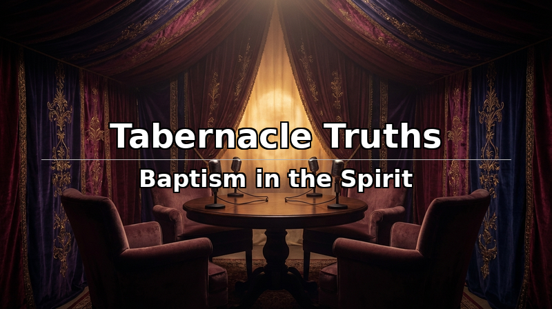

**HOST:** [warm, excited] This is Tabernacle Truths, where we explore Christianity's Jewish roots. I'm your host Jordan, and today we're talking about the Holy Spirit. Is the salvation experience all there is or does he offer more? I've got three brilliant people around this table who come at this from very different places. Professor Arkwright?

**WRIGHT:** [warmly] Jordan, thank you for having me. I'm a biblical theologian — my work focuses on how Israel's story arrives at its fulfillment in Christ and the Spirit.

**HOST:** Dr. Creed?

**CREED:** [friendly] Great to be here, Jordan. I'm a pastor and I teach systematic theology. My instinct is always the same — go back to the text.

**HOST:** And Pastor Carrie?

**CARRIE:** [genuine, warm] Jordan, I love what you're doing with this show. I lead a charismatic congregation and I've done doctoral work in pneumatology — the study of the Holy Spirit.

---

## Part 1: The Common Ground

> [!slide]
> **background:** single candle flame reflecting on dark still water, desaturated deep navy
> **text:** **Romans 8:9** — "If anyone does not have the Spirit of Christ, they do not belong to Christ."

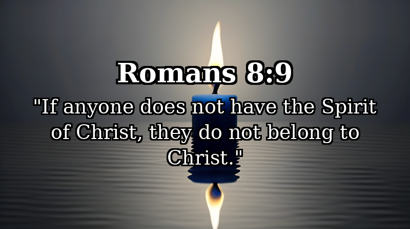

**HOST:** [curious] Before we get into the differences — is there anything you three actually agree on?

**WRIGHT:** [emphatic] The common ground is enormous. Romans 8:9 — if you belong to Christ, the Spirit lives in you. Full stop.

**CREED:** [nodding] And Paul isn't hedging. The grammar is a first-class conditional — he's assuming it's true of every reader.

**CARRIE:** [with conviction] We agree completely. No serious Pentecostal theologian denies that the Spirit indwells every believer at conversion.

**HOST:** [surprised] So what are we exploring today?

**CARRIE:** [thoughtful] Whether having Him and being filled by Him are the same thing.

**HOST:** [quietly] That's a really big distinction, isn't it.

---

## Part 2: Two Kinds of Language

> [!slide]
> **background:** open cupped hands with soft warm light descending from above, desaturated indigo tones
> **text:** **John 14:16-17** — "He will give you another advocate to help you and be with you forever."

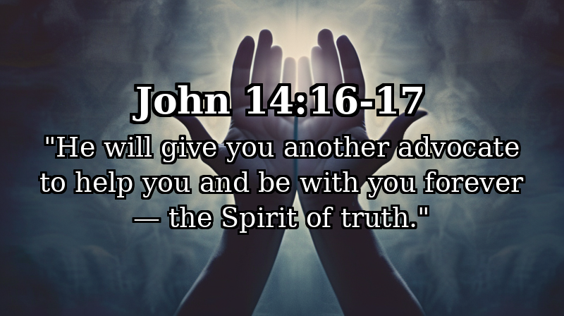

**HOST:** [curious] Dr. Creed, walk me through what Jesus said about the Spirit. Because it feels like He's saying two different things.

**CREED:** [explaining] That's because He is. First — permanent indwelling. John 14: "I will ask the Father, and He will give you another advocate to be with you forever." The Spirit comes and stays.

**WRIGHT:** [building on that] And that "forever" echoes Ezekiel 36 — "I will put my Spirit IN you." Under the old covenant, the Spirit came UPON people for tasks. Under the new covenant, He moves inside. Permanently.

**HOST:** Okay. What's the second category?

**CARRIE:** [leaning in] Power. In John 20, Jesus breathes on His disciples and says "Receive the Holy Spirit." They have the Spirit. And then He tells them to wait.

> [!slide]
> **background:** golden rays breaking through dark storm clouds over distant horizon, desaturated amber
> **text:** **Acts 1:8** — "You will receive power when the Holy Spirit comes on you."

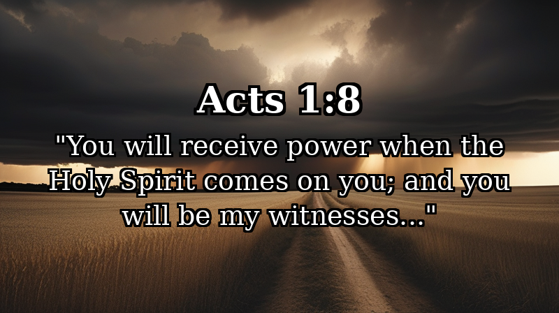

**HOST:** Wait for what?

**CARRIE:** [with emphasis] Acts 1:8. "You will receive power when the Holy Spirit comes on you." They already had the Spirit. Jesus told them to wait for something MORE.

**HOST:** [turning] Dr. Creed, what do you make of that?

**CREED:** [carefully, honestly] It's a real text. The question is whether that gap was a unique historical moment or a pattern for all believers. I'd argue it was unique.

**CARRIE:** [gently pressing] But John the Baptist made the same distinction in ALL four Gospels. Water baptism is one thing. Spirit baptism is something else. Both John and Jesus draw that line.

**HOST:** Professor Arkwright, where do you land?

**WRIGHT:** [warmly] The text doesn't decide that as cleanly as either of them would like. And I think that's worth sitting with.

---

## Part 3: The Tabernacle

> [!slide]
> **background:** ancient desert tabernacle tent with luminous glowing cloud descending, desaturated gold and earth tones
> **text:** **Exodus 40:34** — "The glory of the LORD filled the tabernacle."

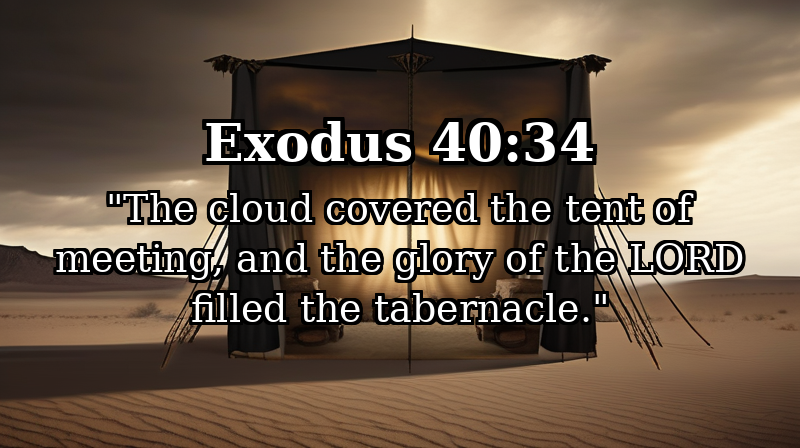

**HOST:** [fascinated] Professor Arkwright, tell me about this tabernacle pattern.

**WRIGHT:** [with passion] The Tabernacle — the mishkan. Three stages: construction, consecration, then the glory fills it. The structure existed before the glory came. And Paul applies this directly to us — your body is a temple of the Holy Spirit.

**HOST:** [awed] So we're the tabernacle.

**WRIGHT:** [emphatic] You're the tabernacle. Built at creation, consecrated at conversion, the glory fills you. But unlike the original, we grieve and quench. The glory doesn't leave — the seal holds — but the filling can be muffled.

**CARRIE:** [excited, building on it] That's the whole debate in one image. The structure exists. The Spirit is IN it. But how much of that tabernacle is the glory actually filling?

> [!slide]
> **background:** cracked red wax seal on dark aged parchment, warm muted earth tones
> **text:** **Ephesians 4:30** — "Do not grieve the Holy Spirit of God."

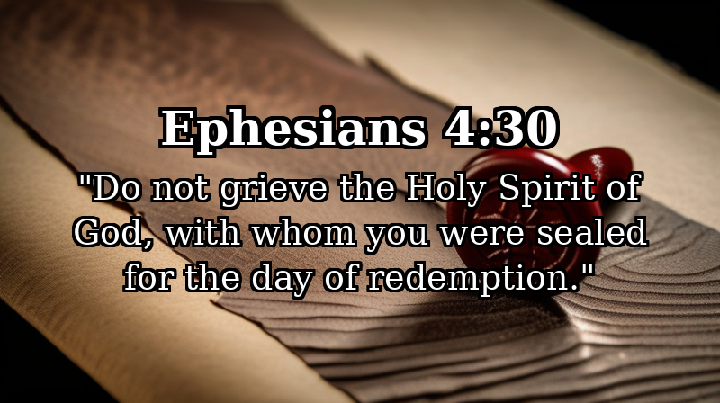

**CREED:** [thoughtful] The analogy is beautiful. I want to be careful with it, though — analogies can carry us further than the text does.

**CARRIE:** [earnest] That's fair. But look at Ezekiel 10 — the glory DEPARTS from the temple because of Israel's sin. Under the new covenant the Spirit doesn't leave, but He can be grieved and quenched. Grieved is relational — you've hurt Him. Quenched is functional — you've SUPPRESSED His activity. And I think a lot of churches have been quenching for a long time without realizing it.

**CREED:** [long pause, honest] That's a serious thing to say, Carrie.

**CARRIE:** [gently] I know. And I say it with love.

**HOST:** [softly, vulnerable] My grandmother's church would never use the word "quench." But nothing unpredictable ever happened there either.

**CARRIE:** [compassionate] Order is not the enemy of the Spirit. But it can become the excuse for His absence.

---

## Part 4: Sealed and Filled

> [!slide]
> **background:** ancient letter with wax seal on dark stone table, single candle, desaturated warm tones
> **text:** **Ephesians 1:13** — "You were sealed with the promised Holy Spirit, the guarantee of our inheritance."

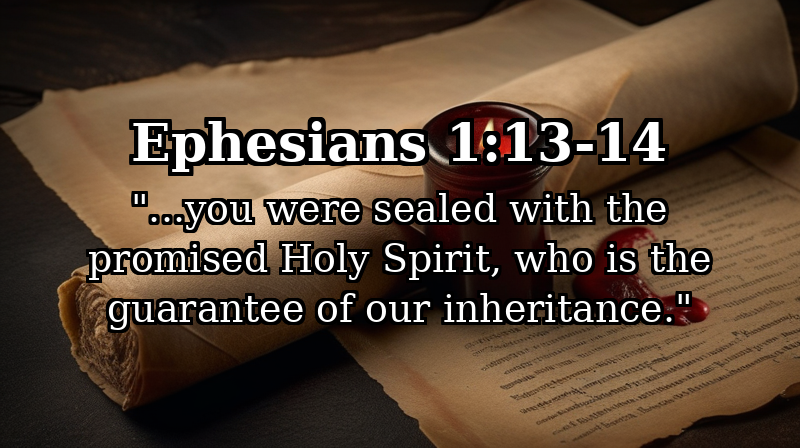

**HOST:** [curious] Dr. Creed, what's your framework for teaching the Spirit?

**CREED:** [clear, teaching] Two categories. The seal — Ephesians 1:13. When you believed, you were sealed. The Greek word for guarantee is arrabon — a down payment. Legally binding. That seal is permanent, not repeated, not earned, not lost.

**WRIGHT:** [adding] And the Spirit seals you into a PROJECT. Paul says God is uniting all things in Christ. You're sealed into the renewal of creation.

> [!slide]
> **background:** full sails billowing on dark open ocean at night, soft silver moonlight, desaturated blue-silver
> **text:** **Ephesians 5:18** — "Be filled with the Spirit." [present tense — keep on being filled]

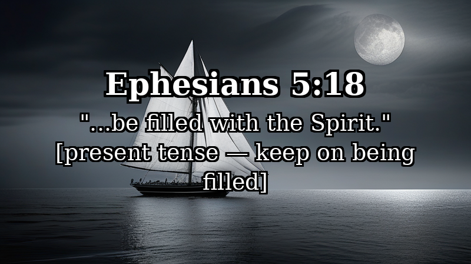

**CARRIE:** [with conviction] But then Paul commands something else. Ephesians 5:18. "Be filled with the Spirit." Present tense — keep on being filled. Passive — it's done TO you. Imperative — a command, not a suggestion.

**HOST:** [working it out] So the seal is... the boat is yours. But the filling is raising the sails.

**CARRIE:** [delighted] Exactly. The wind is always there.

**CREED:** [nodding] I don't dispute the filling is ongoing. What I'm cautious about is whether a dramatic second experience is normative for everyone.

**HOST:** [vulnerable] When I had an experience at a friend's church — was that a second baptism? A fresh filling? Should I expect more?

**CARRIE:** [warmly] More. Definitely more. And here's why — Acts 4:31. They were all filled with the Holy Spirit and spoke the word of God boldly.

> [!slide]
> **background:** ancient stone chamber gradually filling with interior light, dark archways, desaturated gold
> **text:** **Acts 4:31** — "They were all filled with the Holy Spirit and spoke the word of God boldly."

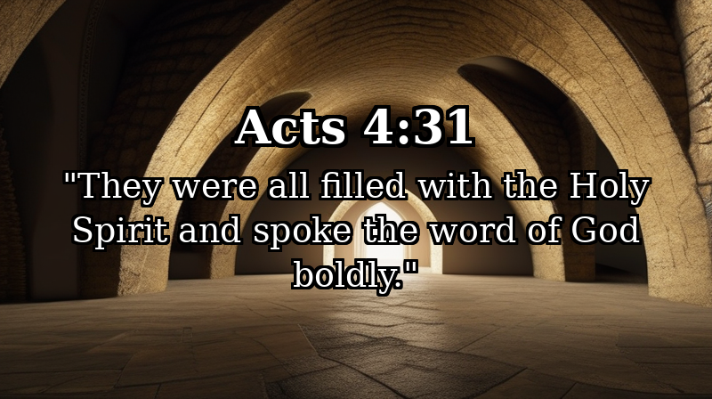

**HOST:** But who's "they"?

**CARRIE:** [pause, letting it land] Back up to Acts 4:13. It's Peter and John. Peter — the guy who preached at Pentecost and saw three thousand people come to faith.

**HOST:** [stunned] Wait. PETER needed another filling?

**CARRIE:** [emphatic] Yes. Peter and John — the most prominent leaders of the early church — prayed together and were filled AGAIN. The text says "they were ALL filled." Peter included.

**WRIGHT:** [moved] And this is so important. If PETER needed fresh filling — Peter who walked on water, who preached Pentecost — then this isn't about spiritual immaturity. It's the rhythm of the Christian life.

**HOST:** [emotional, voice breaking] So it's not that something was wrong with me for needing more. Even Peter needed more.

**CARRIE:** [tender] Even Peter needed more.

---

## Part 5: The Mess in Acts

> [!slide]
> **background:** mosaic of many diverse faces, fragmented tile pattern, desaturated warm earth tones
> **text:** **Acts 8:16** — "The Spirit had not yet come on any of them; they had simply been baptized."

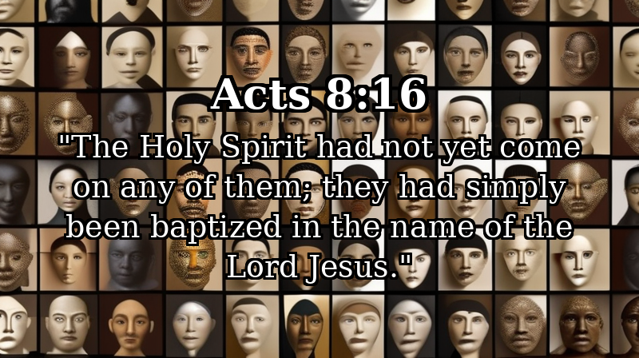

**HOST:** [curious] Let's talk about Acts. Professor Arkwright, is there a pattern?

**WRIGHT:** [animated] The pattern IS the irregularity. The Spirit falls before baptism, after baptism, with the apostles, without them. Luke is showing the Spirit's sovereign movement as the gospel crosses every barrier — Jews, Samaritans, Gentiles.

**HOST:** [puzzled] Dr. Creed, Acts 8 is the one that gets me. They believed, they were baptized, and the Spirit HADN'T come. How does that fit?

**CREED:** [carefully, honestly] The Reformed reading is that Samaria was a unique transitional moment — the gospel crossing from Jews to Samaritans for the first time. It's not a repeatable template.

**CARRIE:** [thoughtful] That's plausible. But you have to use that argument for every unusual case in Acts. At some point, I wonder if we're harmonizing rather than listening to what Luke is actually showing us.

**CREED:** [gently] And I'd say we all need to be careful that our reading isn't shaped more by experience than by the text.

**CARRIE:** [nodding, honest] That's true. We all bring something to the text. I just want us to be honest about what we bring.

---

## Part 6: The Three Views

> [!slide]
> **background:** three separate paths converging toward a single distant light, aerial view, deeply desaturated
> **text:** **1 Corinthians 12:13** — "We were all baptized by one Spirit so as to form one body."

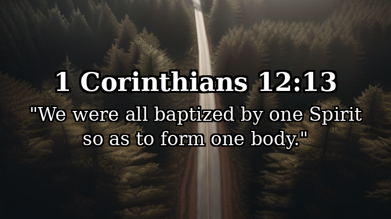

**HOST:** [setting up] I want to lay out the three views clearly. Professor Arkwright, can you walk us through them?

**WRIGHT:** [clear, teaching] View one — the Reformed reading. Spirit baptism is what happens when you believe. Incorporation into Christ. "We were ALL baptized by one Spirit." Universal. Complete. Done.

**HOST:** [turning] Dr. Creed, what's the strength of that — and what's the risk?

**CREED:** [honest, reflective] The strength is Paul's corporate language. The Spirit creates a PEOPLE, not just saved individuals. The risk? [pause] Complacency. The lived experience of the Spirit can quietly disappear from church life.

> [!slide]
> **background:** lone figure in open field, wind visible in tall grass, wide sky, desaturated blue-gray
> **text:** **Matthew 3:11** — "He will baptize you with the Holy Spirit and fire."

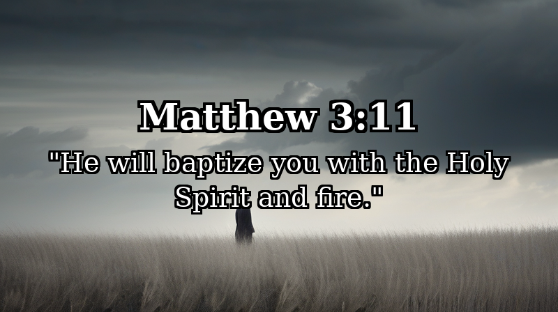

**HOST:** [turning] Pastor Carrie, give me the best version of the Pentecostal view — not the caricature.

**CARRIE:** [with deep conviction] Spirit baptism is the future breaking into the present. Pentecost is Babel in reverse — every barrier comes down. The power you receive isn't for you. It's the age to come flowing through you for mission.

**HOST:** [genuinely moved] I've never heard it put that way. That's way less self-focused than how I was taught.

**CREED:** [appreciative] That IS the best version. Where I get concerned is when churches pressure people to produce tongues as evidence — that moves away from what Paul teaches.

**CARRIE:** [honest, conceding] I won't defend every church in my tradition. We've made mistakes too.

**HOST:** And view three?

**WRIGHT:** [warm] Many fillings. The seal holds — once, permanent. The filling is ongoing. Acts 4:31 — same disciples as Pentecost, filled again.

**HOST:** [hopeful] Is there a version of all three where the practical answer is just... stop blocking it?

**WRIGHT:** [warmly, with conviction] Yes. That's what Paul means by "be filled." Stop grieving it. Stop quenching it. Raise the sails.

---

## Part 7: Hard Questions

> [!slide]
> **background:** single candle flame shielded by cupped hands from wind, dark background, warm amber glow
> **text:** **1 Thessalonians 5:19** — "Do not quench the Spirit."

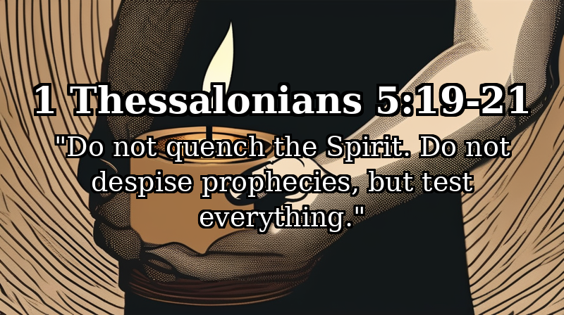

**HOST:** [direct but gentle] I want to go direct. Dr. Creed — has your tradition been testing the Spirit, or quenching Him?

**CREED:** [long pause, vulnerable] Both. Honestly. We test well. We quench well too.

**WRIGHT:** [serious] And that matters, because a church that quenches the Spirit doesn't just become boring. It loses its capacity to be SENT.

**CARRIE:** [passionate but respectful] The global South — Africa, Asia, Latin America — Christianity is exploding. Almost entirely Spirit-movement Christianity. The Western church is declining. At some point we have to ask together if the Spirit is doing something our categories can't contain.

> [!slide]
> **background:** many diverse hands reaching toward center forming a circle, dark background, warm side lighting
> **text:** **1 Corinthians 12:21** — "The eye cannot say to the hand, 'I don't need you!'"

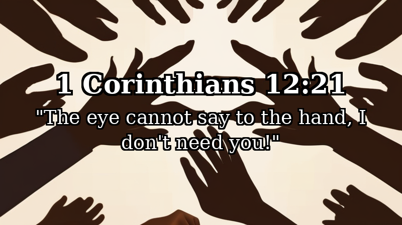

**HOST:** [turning] Pastor Carrie — same question, other direction. What's the shadow side of YOUR tradition?

**CARRIE:** [honest, self-aware] Experience-dependency. Measuring your walk with God by the intensity of your last encounter instead of daily faithfulness. And when not speaking in tongues makes someone feel like a second-class Christian — that contradicts everything Paul said.

**CREED:** [gently adding] And the mission question. The Spirit at Pentecost didn't come so the disciples could have an experience. He came so the gospel could cross every barrier.

**WRIGHT:** [reflective] Every tradition has blind spots. The question is whether we love our traditions more than the truth they were trying to protect.

---

## Part 8: The Bottom Line

> [!slide]
> **background:** lone person walking along empty city street in early morning blue dawn light, long shadows
> **text:** **Galatians 5:25** — "If we live by the Spirit, let us also keep in step with the Spirit."

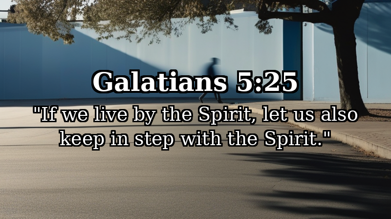

**HOST:** [warm] One sentence each. Dr. Creed?

**CREED:** [with weight] You have the Spirit. You may not be filled. The seal is permanent — the filling is daily.

**HOST:** Professor Arkwright?

**WRIGHT:** [moved, passionate] The Spirit of God tabernacles in you — the same Spirit who hovered over the waters at creation, who filled the mishkan, who descended on Jesus at the Jordan. He's not a theology topic. He's a person. And He wants to fill every corner of your life — and then send you out.

**HOST:** Pastor Carrie?

**CARRIE:** [gentle, strong] Stop building walls. Start raising sails. The wind never stops blowing.

**HOST:** [pause, emotional] I started this show because something happened to me I couldn't explain. I don't think these three explained it either. But I understand the question now. It's not "do I need a second baptism?" It's "am I raising the sails today?" [pause] That's Tabernacle Truths. Thanks for watching.

---

## Equilibrium Report

| Voice | Lines | Words | Initiates | Concedes | Challenged By |
|-------|-------|-------|-----------|----------|---------------|
| HOST | 32 | ~550 | 8 | 0 | — |
| WRIGHT | 14 | ~430 | 3 | 0 | CREED |
| CREED | 14 | ~370 | 2 | 1 (quenching) | CARRIE |
| CARRIE | 16 | ~400 | 4 | 1 (tradition) | CREED |
