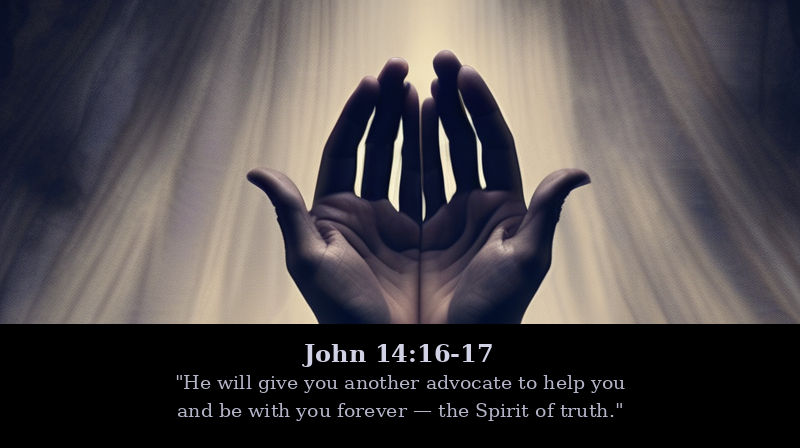
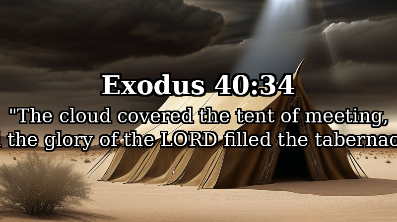
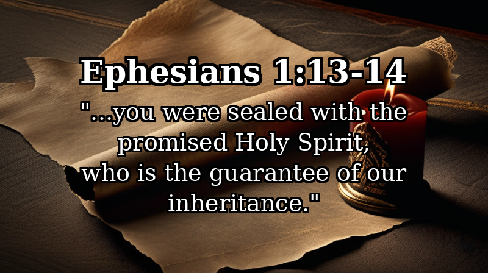
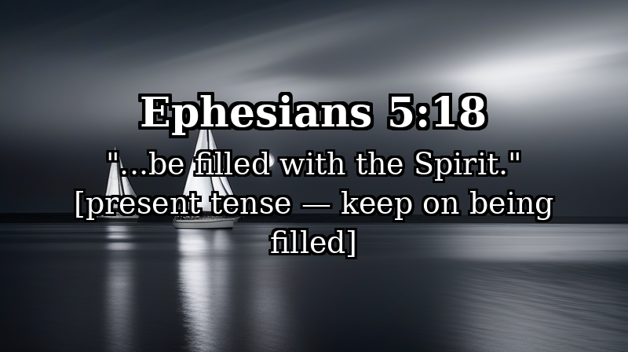
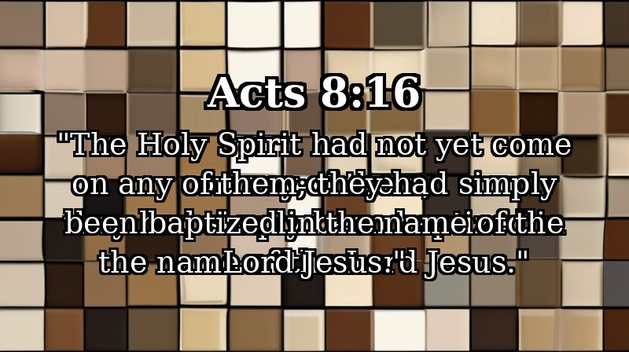
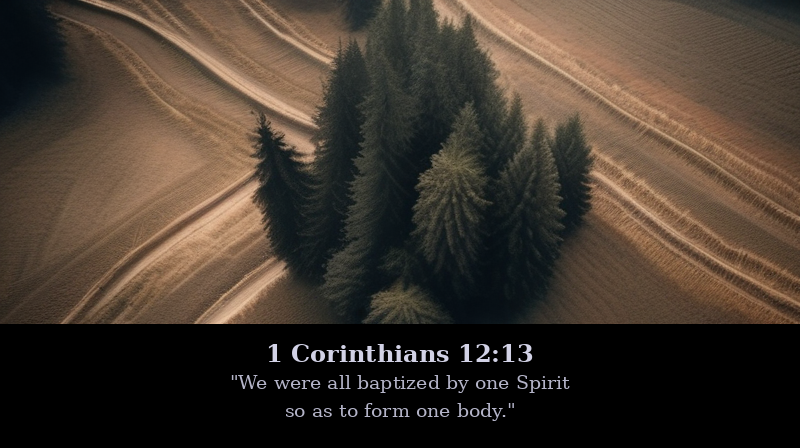
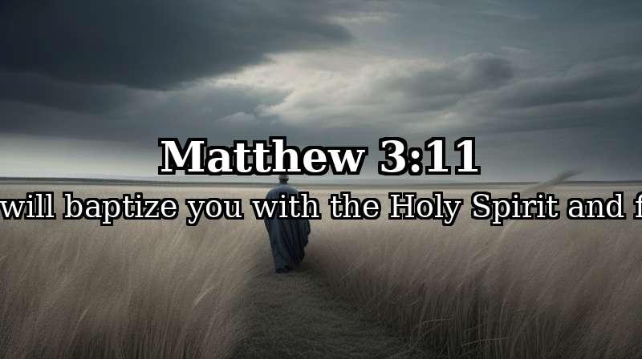
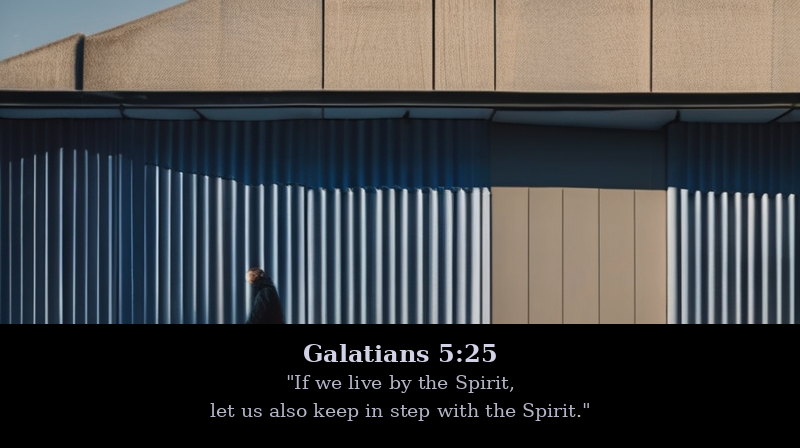

# Baptism in the Spirit: A Panel Discussion
<!-- topic: handouts/baptism-in-the-spirit.md -->
<!-- voices: WRIGHT, BT, PT, LAY -->
<!-- casting: WRIGHT=deep British male academic; BT=confident woman; PT=educated passionate man; LAY=inquisitive 20-something woman -->

---

## The Common Ground

> [!slide]
> **background:** single flame reflected on still dark water, navy and black, highly desaturated
> **text:** **Romans 8:9** — "If anyone does not have the Spirit of Christ, they do not belong to Christ."

**WRIGHT:** Before the disagreements begin — and I promise they will — I want us to name what every tradition in this room actually agrees on. Romans 8:9. If you belong to Christ, the Spirit of God lives in you. That's not up for debate.

**BT:** And the grammar bears that out. Paul is writing a first-class conditional — he's not raising a hypothetical. He's assuming his readers have the Spirit. Every single one of them. That's the baseline.

**PT:** Agreed. No serious Pentecostal theologian denies that the Spirit indwells every believer at conversion. If you hear us saying otherwise, we're being misunderstood.

**LAY:** Okay good — so then what are we actually debating?

**PT:** Whether indwelling and empowering are the same thing.

**LAY:** [pause] Oh. That's actually a big difference, isn't it.

---

## Two Kinds of Language

> [!slide]
> **background:** open doorway into soft light, dark stone threshold, desaturated warm tones
> **text:** **John 14:16-17** — "He will give you another advocate to help you and be with you forever — the Spirit of truth."

**WRIGHT:** What's fascinating is that Jesus uses two quite distinct categories of language about the Spirit — and conflating them is where most of the confusion begins. There's the permanent-indwelling language — John 14, "with you forever" — and then there's power-and-mission language. They're not the same.

**BT:** That's a fair distinction. The John 14 language is covenantal. "With you forever" echoes "I will be your God and you will be my people." The Spirit seals that relationship. It's not primarily experiential — it's ontological.

**PT:** But Jesus also told His disciples — *after* He breathed on them in John 20, after He said "Receive the Holy Spirit" — to *wait* for something more. Acts 1:8. They already had the Spirit. And He told them to wait.

**LAY:** That's the part that always confused me growing up. I was taught everything happened at conversion. But then I visited a different kind of church, and something happened that I couldn't explain with the theology I had.

**BT:** I want to take that seriously — I really do. But we have to be careful about making experience the foundation and then reading Scripture to justify it.

**WRIGHT:** Though one might ask whether Scripture itself is full of experiences that people then wrestled to understand. The canon isn't a systematic theology that preceded the events. It's the record of those who encountered God and tried to name what happened.

> [!slide]
> **background:** figures waiting in an upper room, dim amber light through narrow windows, deeply desaturated
> **text:** **Acts 1:8** — "You will receive power when the Holy Spirit comes on you; and you will be my witnesses..."

**PT:** And this is precisely the text. They had the Spirit — John 20:22 — and yet Jesus says *wait for power*. That gap is not accidental. John the Baptist made the same distinction in all four Gospels: water baptism is one thing, Spirit baptism is something else.

**BT:** The question is whether that gap was a transitional historical moment — the ascension hadn't happened, Pentecost was still coming — or whether it's a template for all believers in all times. I'd argue the former.

**WRIGHT:** And I'd argue the text doesn't decide that question as cleanly as either of you would like. Which is rather the point, isn't it?

**LAY:** [laughs] Great, so we're already stuck.

---

## The Tabernacle Pattern

> [!slide]
> **background:** ancient tabernacle silhouette with pillar of cloud descending, desert dusk, desaturated gold and black
> **text:** **Exodus 40:34** — "The cloud covered the tent of meeting, and the glory of the LORD filled the tabernacle."

**WRIGHT:** I want to introduce a framework that might reframe the whole debate. The Tabernacle. God instructs Moses to build it — construction first. Then consecration. Then the glory fills it. Three stages. And Paul applies this pattern directly to persons: your body is a temple of the Holy Spirit.

**PT:** Right — same pattern. We're formed, we're consecrated at conversion, and then the glory fills us. And that filling is ongoing — because unlike the Tabernacle, we grieve and quench. The structure exists before the glory fully fills it.

**BT:** The analogy is suggestive, I'll grant that. But analogies aren't arguments. You can't build a two-stage pneumatology on an architectural metaphor.

**WRIGHT:** Fair enough. But consider what happens to the glory in Ezekiel 10. The glory *departs* from the temple because Israel's sin made the presence untenable. Under the new covenant the Spirit doesn't leave — the seal holds. But can His active influence be... muffled?

**LAY:** That's exactly what it felt like for me. Not like God had left. More like I'd built so many walls of control — or respectability — and one night at a friend's church those walls just came down and He was *right there*. He'd been there the whole time. I just couldn't feel Him through all the proper Baptist decorum. [laughs]

> [!slide]
> **background:** cracked wax seal impression, warm muted earth tones on dark background
> **text:** **Ephesians 4:30** — "Do not grieve the Holy Spirit of God, with whom you were sealed for the day of redemption."

**BT:** Notice Paul's language — "grieve." You grieve a *person*, not a force. The Spirit can be present and grieved at the same time. I think that framework gets at something real without requiring a second-blessing structure.

**PT:** But Paul also uses "quench" in 1 Thessalonians. Grieved and quenched aren't the same. Grieved is relational — you've hurt Him. Quenched is functional — you've *suppressed* His activity. And I think a lot of traditional churches have been quenching for generations.

**BT:** That's a serious charge.

**PT:** It's a serious problem.

**WRIGHT:** [carefully] There may be evidence for it. When you look at the global South — the explosive growth of Christianity in sub-Saharan Africa, East Asia, Latin America — it's almost entirely Spirit-movement Christianity. And the Western church is largely declining. At some point you have to ask whether the Spirit is doing something our inherited categories can't contain.

**LAY:** My grandmother's church would never use the word "quench." But nothing unpredictable ever happened there either. Everything was very orderly.

**BT:** Order is not the enemy of the Spirit.

**PT:** No. But it can become the excuse for His absence.

**LAY:** That's my grandmother's church in one sentence.

---

## Sealed Once, Filled Continually

> [!slide]
> **background:** ancient letter with wax seal on dark stone table, single candle, desaturated warm tones
> **text:** **Ephesians 1:13-14** — "...you were sealed with the promised Holy Spirit, who is the guarantee of our inheritance."

**BT:** This is where I think Paul is at his clearest. The seal happens at conversion — "when you believed." The Greek *arrabōn* is a down payment — a legal guarantee. The Spirit's presence in you is God's binding commitment to complete what He started. That seal is not repeated. It's not earned. It's not lost.

**WRIGHT:** And the eschatological dimension of that is stunning, actually. The Spirit seals you into a project — Paul says God is uniting *all things* in Christ. You're not just saved individually. You're sealed into the renewal of creation. The Spirit in you is the first fruits of the new world.

**PT:** All of which I affirm. The seal is once. But Paul then commands something else entirely —

> [!slide]
> **background:** full sails on dark open water, moonlight, highly desaturated blue-silver
> **text:** **Ephesians 5:18** — "...be filled with the Spirit." [present tense — keep on being filled]

**PT:** *Plērousthe.* Present tense. Continuous. Passive voice — it's something done *to* you, not achieved by you. Imperative — a command, not a suggestion. Paul is not saying "remember when you received the Spirit." He's saying: *keep being filled, right now, all the time.*

**LAY:** So it's less like a one-time event and more like... breathing?

**PT:** That's exactly right.

**BT:** I don't dispute the ongoing nature of the filling. What I dispute is whether a dramatic second experience is *normative* — whether every believer should expect a Pentecost moment. Paul's command is for continuous filling, not a punctiliar crisis.

**WRIGHT:** And perhaps that distinction — ongoing versus punctiliar — is where the pastoral question really lands. Some people encounter a dramatic moment of fresh surrender. Others walk a slower path of increasing yield to the Spirit. Both may be described by the same Greek imperative.

**LAY:** When I had that experience — the one I mentioned — was that a second baptism? A fresh filling? I genuinely don't know what to call it.

**BT:** Does it need a name?

**LAY:** Well, it would help to know whether I should expect more of them or whether that was *the thing*.

**PT:** More. Definitely more. Acts 4:31 — same disciples, same Spirit, filled *again* when they prayed under threat. Luke doesn't treat this as unusual. This is the normal rhythm of Spirit-empowered life.

---

## What Acts Actually Shows Us

> [!slide]
> **background:** mosaic of faces from many different nations, fragmented, desaturated earth tones
> **text:** **Acts 8:16** — "The Holy Spirit had not yet come on any of them; they had simply been baptized in the name of the Lord Jesus."

**WRIGHT:** Acts is where the debate genuinely complicates itself — and I think that's deliberate. Luke's narrative. The Spirit doesn't follow the same sequence twice. Pentecost: Spirit comes after repentance and baptism. Cornelius in Acts 10: Spirit falls *before* water baptism, while Peter is still preaching. Ephesus in Acts 19: a gap, a laying on of hands, then the Spirit. And here in Samaria: they believed, they were baptized — and the Spirit had not yet come.

**BT:** The Reformed reading of Samaria is that it was a unique transitional moment — the gospel crossing from Jews to Samaritans for the very first time. Peter and John's presence, the laying on of hands, the delayed Spirit — all of it signals the Samaritans' full inclusion into the one covenant community. It's not a repeatable template.

**PT:** That's a plausible reading. I'll grant Acts 8 has transitional features. But it requires explaining away *every* unusual case as a transitional moment. At some point you're harmonizing rather than exegeting.

**BT:** And at some point your reading is shaped more by experience than by the text.

**PT:** [evenly] We all bring something to the text.

**WRIGHT:** What I find compelling in Luke's narrative is precisely the *irregularity*. He's not giving us a formula. He's showing the Spirit moving sovereignly across every barrier that sin erected — Jew, Samaritan, Gentile, pre-Pentecost disciple. The Spirit is not a spiritual checklist. He's the agent of new creation, and He refuses to be systematized.

**LAY:** So when a church tells someone they need to "get the second blessing" — and puts pressure on people to speak in tongues as proof — is that right?

**PT:** That phrasing — "get" it, as a formula you perform — I'd be uncomfortable with too. The Spirit distributes gifts as He wills. Tongues are not the universal evidence.

**BT:** Paul says as much. "Do all speak in tongues?" — rhetorical question, expected answer: no.

---

## Three Views, One Spirit

> [!slide]
> **background:** three separate paths converging toward a single distant light, aerial view, deeply desaturated
> **text:** **1 Corinthians 12:13** — "We were all baptized by one Spirit so as to form one body."

**WRIGHT:** Let me try to name the three positions as charitably as I can. The first — the Reformed and Baptist reading — says Spirit baptism is what happens when you believe. It's incorporation into Christ. "We were all baptized" — universal, past tense, complete. The seal holds.

**BT:** And the strength of that is Paul's corporate language. The Spirit creates a *people*, not just saved individuals. Spirit baptism isn't primarily about personal empowerment — it's about being incorporated into the body. Once for all.

**PT:** But John the Baptist's distinction survives all of that. Water baptism and Spirit baptism are explicitly contrasted — by John, by Jesus, in all four Gospels. Something Jesus does that John couldn't. If they were the same event, why distinguish them at all?

> [!slide]
> **background:** lone figure in open field, wind visible in tall grass, wide sky, desaturated blue-gray
> **text:** **Matthew 3:11** — "He will baptize you with the Holy Spirit and fire."

**WRIGHT:** The second view — Pentecostal and Charismatic — takes that distinction seriously. Spirit baptism is a subsequent empowerment, distinct from conversion, available to every believer. And the most careful Pentecostal theology frames it eschatologically: when the Spirit falls, the *future breaks into the present*. The power you receive isn't for you — it's the power of the coming kingdom flowing through you.

**PT:** That's exactly right. Spirit baptism isn't a spiritual achievement. It's the age to come arriving ahead of schedule. Pentecost is Babel in reverse — the Spirit falls, and every barrier comes down. That's not about personal experience. That's about mission.

**LAY:** I've never heard it explained that way. That makes it feel a lot less... self-focused than how I was taught.

**BT:** And that *is* the best version of the Pentecostal case. But when churches put pressure on people to produce tongues as evidence — that directly contradicts Paul's own argument. And making dramatic experience the measure of spiritual maturity — that was the *problem* in Corinth, not their strength.

**PT:** [nods] I won't defend every church in my tradition. You're right about Corinth.

> [!slide]
> **background:** ancient stone chamber gradually filling with interior light, dark archways, desaturated gold
> **text:** **Acts 4:31** — "They were all filled with the Holy Spirit and spoke the word of God boldly."

**WRIGHT:** And there's a third view — the one I find most exegetically honest — which says the pattern is neither one event nor two events but *many fillings*. Same disciples in Acts 4 as Acts 2. Same Spirit. Filled again. Luke narrates this without comment, as if it's entirely expected.

**BT:** I can work with that framework. The seal holds — once, at conversion, permanent. The filling is ongoing, commanded, possible to grieve or quench. That preserves the Reformed insistence on security while taking the Pentecostal insistence on experience seriously. Both things are true.

**PT:** My only hesitation is that "many fillings" can become comfortable enough to avoid the sharp question: have you actually *surrendered* to the Spirit's empowering work? The framework can become a way to manage the topic rather than enter it.

**LAY:** Is there a version of all three views where the practical answer is just... stop blocking it?

**WRIGHT:** [smiles] Yes. That's rather what Paul means by "be filled." Stop grieving it. Stop quenching it. Raise the sails.

**LAY:** I think I've been sitting in the boat waiting for a wind report.

---

## What Does This Mean on Monday?

> [!slide]
> **background:** early morning light on an ordinary city street, single figure walking, desaturated blue-dawn
> **text:** **Galatians 5:25** — "If we live by the Spirit, let us also keep in step with the Spirit."

**LAY:** Okay, so — bringing this to Monday morning. I had this experience. I don't know what to call it. Do I go back to my Baptist church? Do I look for a Pentecostal church? Do I try to repeat it? Do I just... keep going?

**PT:** You don't need to leave your church. But you may need to stop apologizing for what happened. The Spirit is not embarrassing. He's not a disruption to good theology — He's what good theology points *toward*.

**BT:** And you don't need to build a new theological system on one experience. What you had was real. What Paul calls you to is a *daily* walk — "keep in step." That's not a crisis event every few years. That's orientation, every morning.

**WRIGHT:** There's a phrase in Galatians — "keep in step with the Spirit." The Greek is *stoicheō* — to walk in a line, in formation. It implies the Spirit has a direction He's moving, and you're either moving with Him or you're not. The question isn't which experience you've had. It's whether your life is oriented toward what He is doing in the world.

**LAY:** Which is what, exactly?

**WRIGHT:** New creation. The Spirit is the agent of the new world — renewing people, breaking down barriers, forming communities that look like the coming kingdom, across every line that sin draws. If He's filling you for anything, it's to be part of that.

**PT:** And that's why the filling is never just for you. Every filling in Acts results in outward movement — proclamation, barrier-crossing, community formation. If your experience of the Spirit has left you more inward-focused, something may have gone sideways.

**BT:** [pause] That's the word I'd want people to take home. Not "do you have the second blessing?" But — is the Spirit *sending you out?* That's the Pentecost question. Not an experience to collect. A mission to join.

**LAY:** I feel like I've had the experience but I haven't found the mission yet.

**PT:** Then you're exactly where you need to be.

---

## Equilibrium Report

| Voice | Lines | Words | Initiates | Concedes | Challenged By | Last Word |
|-------|-------|-------|-----------|----------|---------------|-----------|
| WRIGHT | 15 | 560 | 5 | 1 | BT, PT | 1 |
| BT | 17 | 490 | 3 | 2 | WRIGHT, PT | 1 |
| PT | 17 | 460 | 4 | 2 | BT, WRIGHT | 1 |
| LAY | 16 | 320 | 2 | 0 | — | 4 |

**Balance notes:** LAY closes 4 of 7 sections — Common Ground, Two Kinds of Language, The Tabernacle Pattern, and Three Views. Her closers range from dawning realization ("Oh. That's actually a big difference") to dry humor ("Great, so we're already stuck") to devastating compression ("That's my grandmother's church in one sentence") to self-aware metaphor ("I've been sitting in the boat waiting for a wind report"). BT concedes to PT on tongues-as-evidence and on the Corinthians critique. PT concedes to BT on Acts 8 transitional features and on problematic church practices. WRIGHT is challenged by BT on the analogy-as-argument point and implicitly by PT on whether the Spirit's irregularity has theological significance.
